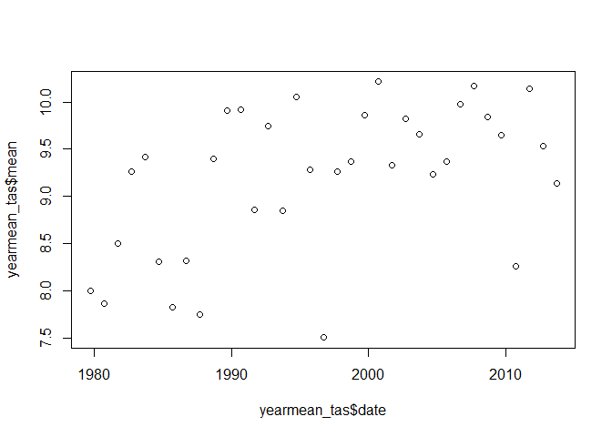

processNC - R Package for processing and analysing (large) NetCDF files in R
================
Matthias Biber
2017-09-11

Overview
--------

`processNC` is an R package for processing and analysing NetCDF files in R. Small NetCDF files can easily be loaded into R using the `raster()` function from the `raster` package in R, given that the `ncdf4` package is installed. However, using this approach the entire file is read into memory and so memory limits are reached quickly when trying to load large NetCDF files.

The need for this package arised from the task to load large NetCDF files with global daily climate data to calculate monthly or yearly averages. With this package this task can be achieved without having to read the entire file into memory.

For this, the package mainly consists of two functions:

-   `subsetNC()` subsets one or multiple NetCDF files by space (x,y), time and/or variable
-   `summariseNC()` summarises one or multiple NetCDF files over time
-   `cellstatsNC()` calculates the spatial mean of one or multiple NetCDF files

In addition, there is also a function called `summariseRaster`, which allows a similar implementation to the `summariseNC` function, but using raster files rather than NetCDF files.

<!-- You can learn more about the different functions in `vignette("processNC")`.-->
Installation
------------

To *use* the package, it can be installed directly from GitHub using the `devtools` package.

``` r
# If not yet installed, install the devtools package
install.packages("devtools")

# Download the package from GitHub
devtools::install_github("RS-eco/processNC")
```

Usage
-----

Load processNC package

``` r
library(processNC)
```

List NetCDF data files

``` r
# List daily temperature files for Germany from 1979 till 2013 (EWEMBI ISIMIP2b data)
files <- list.files(paste0(system.file(package="processNC"), "/extdata"), full.names=T)

# Show files
files
```

    [1] "C:/Users/mbiber/Documents/R/win-library/3.4/processNC/extdata/tas_ewembi_deu_1979_1980.nc"
    [2] "C:/Users/mbiber/Documents/R/win-library/3.4/processNC/extdata/tas_ewembi_deu_1981_1990.nc"
    [3] "C:/Users/mbiber/Documents/R/win-library/3.4/processNC/extdata/tas_ewembi_deu_1991_2000.nc"
    [4] "C:/Users/mbiber/Documents/R/win-library/3.4/processNC/extdata/tas_ewembi_deu_2001_2010.nc"
    [5] "C:/Users/mbiber/Documents/R/win-library/3.4/processNC/extdata/tas_ewembi_deu_2011_2013.nc"

Subset NetCDF file

``` r
# Subset NetCDF files by time and rough extent of Bavaria
subsetNC(files, ext=c(8.5, 14, 47, 51), startdate=1990, enddate=1999)
```

    class       : RasterStack 
    dimensions  : 10, 6, 60, 3288  (nrow, ncol, ncell, nlayers)
    resolution  : 0.9166667, 0.4  (x, y)
    extent      : 8.5, 14, 47, 51  (xmin, xmax, ymin, ymax)
    coord. ref. : +proj=longlat +datum=WGS84 +no_defs +ellps=WGS84 +towgs84=0,0,0 
    names       : X1990.01.01, X1990.01.02, X1990.01.03, X1990.01.04, X1990.01.05, X1990.01.06, X1990.01.07, X1990.01.08, X1990.01.09, X1990.01.10, X1990.01.11, X1990.01.12, X1990.01.13, X1990.01.14, X1990.01.15, ... 
    min values  :    268.2550,    269.4496,    269.9260,    268.7616,    269.0258,    269.5515,    266.3336,    266.5575,    267.9392,    268.0426,    268.6588,    267.2176,    268.5135,    268.0288,    269.4830, ... 
    max values  :    272.5554,    272.0455,    272.0891,    272.1550,    273.2923,    274.2967,    272.8197,    273.3356,    274.3950,    273.8759,    274.0204,    273.8117,    272.9468,    274.2203,    275.7679, ... 

``` r
# Get SpatialPolygonsDataFrame of Bavaria
data(bavaria)

# Subset NetCDF file by SpatialPolygonDataFrame
subsetNC(files, ext=bavaria)
```

    class       : RasterBrick 
    dimensions  : 9, 5, 45, 12784  (nrow, ncol, ncell, nlayers)
    resolution  : 0.9727318, 0.3660113  (x, y)
    extent      : 8.975925, 13.83958, 47.27012, 50.56422  (xmin, xmax, ymin, ymax)
    coord. ref. : +proj=longlat +datum=WGS84 +no_defs +ellps=WGS84 +towgs84=0,0,0 
    data source : in memory
    names       : X1979.01.01, X1979.01.02, X1979.01.03, X1979.01.04, X1979.01.05, X1979.01.06, X1979.01.07, X1979.01.08, X1979.01.09, X1979.01.10, X1979.01.11, X1979.01.12, X1979.01.13, X1979.01.14, X1979.01.15, ... 
    min values  :    258.5225,    259.2864,    262.5962,    261.2245,    259.8299,    261.2420,    262.6502,    266.7570,    269.9405,    269.7677,    270.7775,    269.8421,    268.8952,    267.8006,    265.1033, ... 
    max values  :    265.4785,    262.7227,    265.5797,    263.6797,    261.9867,    263.5001,    265.7485,    270.3293,    273.8665,    272.1921,    272.2344,    271.9499,    270.9982,    269.5755,    267.8779, ... 

``` r
# Subset NetCDF file just by time
subsetNC(files, startdate=1990, enddate=1999)
```

    class       : RasterStack 
    dimensions  : 17, 14, 238, 3288  (nrow, ncol, ncell, nlayers)
    resolution  : 0.6071429, 0.4117647  (x, y)
    extent      : 6.25, 14.75, 47.75, 54.75  (xmin, xmax, ymin, ymax)
    coord. ref. : +proj=longlat +datum=WGS84 +no_defs +ellps=WGS84 +towgs84=0,0,0 
    names       : X1990.01.01, X1990.01.02, X1990.01.03, X1990.01.04, X1990.01.05, X1990.01.06, X1990.01.07, X1990.01.08, X1990.01.09, X1990.01.10, X1990.01.11, X1990.01.12, X1990.01.13, X1990.01.14, X1990.01.15, ... 
    min values  :    268.2550,    268.8760,    269.7884,    268.2937,    267.8489,    268.2939,    265.9402,    265.4810,    267.7947,    268.0426,    268.6028,    267.2176,    267.4866,    267.7701,    268.2850, ... 
    max values  :    274.5740,    274.6320,    274.9313,    273.3459,    276.0111,    276.3013,    277.2385,    278.2452,    279.2395,    279.6846,    280.9291,    280.3109,    277.7491,    276.3155,    278.7222, ... 

Summarise NetCDF file

``` r
# Summarise daily NetCDF file for 10 years 
summariseNC(files, startdate=2000, enddate=2009, group_col=c("year", "month"))
```

    class       : RasterBrick 
    dimensions  : 15, 18, 270, 12  (nrow, ncol, ncell, nlayers)
    resolution  : 0.5, 0.5  (x, y)
    extent      : 6, 15, 47.5, 55  (xmin, xmax, ymin, ymax)
    coord. ref. : +proj=longlat +datum=WGS84 +no_defs +ellps=WGS84 +towgs84=0,0,0 
    data source : in memory
    names       : January, February,  March,  April,    May,   June,   July, August, September, October, November, December 
    min values  :  269.89,   271.47, 274.21, 278.55, 283.54, 286.53, 287.96, 287.80,    283.78,  280.54,   274.96,   271.06 
    max values  :  276.62,   277.55, 280.30, 284.65, 289.23, 292.27, 293.59, 293.19,    289.14,  284.96,   280.78,   277.04 

``` r
# Summarise daily NetCDF files for all years
yearly_tas <- summariseNC(files, group_col = "year")
yearmean_tas <- as.data.frame(raster::cellStats(yearly_tas, stat="mean"))
colnames(yearmean_tas) <- "mean"
yearmean_tas$date <- as.Date(sub("X", "", rownames(yearmean_tas)), format="%Y")
yearmean_tas$mean <- yearmean_tas$mean - 273.15
plot(yearmean_tas$mean ~ yearmean_tas$date)
```



CellStats NetCDF file

``` r
# Summarise daily NetCDF file for 10 years 
cellstatsNC(files, startdate=2000, enddate=2009)
```

             mean       date
    1    273.7878 2000-01-01
    2    274.9809 2000-01-02
    3    275.6813 2000-01-03
    4    276.3606 2000-01-04
    5    277.3515 2000-01-05
    6    277.0308 2000-01-06
    7    276.1777 2000-01-07
    8    277.6484 2000-01-08
    9    277.0032 2000-01-09
    10   276.1733 2000-01-10
    11   274.1296 2000-01-11
    12   273.0629 2000-01-12
    13   272.4310 2000-01-13
    14   271.6186 2000-01-14
    15   272.2188 2000-01-15
    16   272.1733 2000-01-16
    17   273.5671 2000-01-17
    18   277.2129 2000-01-18
    19   276.8777 2000-01-19
    20   273.2489 2000-01-20
    21   274.1674 2000-01-21
    22   274.3388 2000-01-22
    23   273.2589 2000-01-23
    24   270.5252 2000-01-24
    25   266.7812 2000-01-25
    26   266.9812 2000-01-26
    27   270.4672 2000-01-27
    28   272.1098 2000-01-28
    29   273.3448 2000-01-29
    30   277.7163 2000-01-30
    31   278.8803 2000-01-31
    32   280.1657 2000-02-01
    33   279.8183 2000-02-02
    34   278.9041 2000-02-03
    35   276.9261 2000-02-04
    36   277.2694 2000-02-05
    37   279.9709 2000-02-06
    38   280.2970 2000-02-07
    39   279.9122 2000-02-08
    40   280.8261 2000-02-09
    41   277.0875 2000-02-10
    42   277.7925 2000-02-11
    43   276.6615 2000-02-12
    44   275.2226 2000-02-13
    45   276.4329 2000-02-14
    46   275.7702 2000-02-15
    47   278.3326 2000-02-16
    48   275.7668 2000-02-17
    49   273.6760 2000-02-18
    50   274.5713 2000-02-19
    51   276.2857 2000-02-20
    52   274.1144 2000-02-21
    53   272.6317 2000-02-22
    54   274.1863 2000-02-23
    55   274.9756 2000-02-24
    56   277.3646 2000-02-25
    57   278.1084 2000-02-26
    58   276.5833 2000-02-27
    59   277.8624 2000-02-28
    60   282.2738 2000-02-29
    61   279.4595 2000-03-01
    62   278.3921 2000-03-02
    63   275.8930 2000-03-03
    64   278.5859 2000-03-04
    65   274.6013 2000-03-05
    66   273.4413 2000-03-06
    67   276.7017 2000-03-07
    68   280.0459 2000-03-08
    69   281.8737 2000-03-09
    70   282.5732 2000-03-10
    71   278.4577 2000-03-11
    72   280.0382 2000-03-12
    73   278.2912 2000-03-13
    74   279.4828 2000-03-14
    75   280.2689 2000-03-15
    76   276.1119 2000-03-16
    77   277.5012 2000-03-17
    78   278.4984 2000-03-18
    79   277.5827 2000-03-19
    80   277.1950 2000-03-20
    81   277.5977 2000-03-21
    82   279.1271 2000-03-22
    83   280.7441 2000-03-23
    84   281.2902 2000-03-24
    85   281.4007 2000-03-25
    86   281.9577 2000-03-26
    87   280.0209 2000-03-27
    88   277.8510 2000-03-28
    89   277.4078 2000-03-29
    90   279.3463 2000-03-30
    91   278.7289 2000-03-31
    92   278.7373 2000-04-01
    93   280.4887 2000-04-02
    94   283.4771 2000-04-03
    95   283.5634 2000-04-04
    96   279.4531 2000-04-05
    97   276.8576 2000-04-06
    98   278.4766 2000-04-07
    99   279.2233 2000-04-08
    100  280.0526 2000-04-09
    101  279.3884 2000-04-10
    102  280.3914 2000-04-11
    103  279.7566 2000-04-12
    104  279.8872 2000-04-13
    105  281.3588 2000-04-14
    106  281.9382 2000-04-15
    107  282.7574 2000-04-16
    108  283.9440 2000-04-17
    109  283.9388 2000-04-18
    110  284.0765 2000-04-19
    111  285.5659 2000-04-20
    112  288.2614 2000-04-21
    113  290.1425 2000-04-22
    114  290.3649 2000-04-23
    115  285.2677 2000-04-24
    116  285.1111 2000-04-25
    117  288.4658 2000-04-26
    118  291.1392 2000-04-27
    119  292.4856 2000-04-28
    120  290.0336 2000-04-29
    121  289.1654 2000-04-30
    122  288.3060 2000-05-01
    123  288.7821 2000-05-02
    124  288.4224 2000-05-03
    125  288.3303 2000-05-04
    126  288.9316 2000-05-05
    127  289.8846 2000-05-06
    128  290.5065 2000-05-07
    129  290.6096 2000-05-08
    130  291.0506 2000-05-09
    131  291.8266 2000-05-10
    132  292.2791 2000-05-11
    133  289.3347 2000-05-12
    134  288.2898 2000-05-13
    135  290.2110 2000-05-14
    136  292.4161 2000-05-15
    137  293.7894 2000-05-16
    138  290.9733 2000-05-17
    139  286.0260 2000-05-18
    140  283.6370 2000-05-19
    141  282.6891 2000-05-20
    142  284.0600 2000-05-21
    143  284.0367 2000-05-22
    144  286.1436 2000-05-23
    145  287.9779 2000-05-24
    146  288.2990 2000-05-25
    147  287.9082 2000-05-26
    148  287.2094 2000-05-27
    149  285.7257 2000-05-28
    150  283.4147 2000-05-29
    151  283.3171 2000-05-30
    152  284.9647 2000-05-31
    153  288.1228 2000-06-01
    154  292.3322 2000-06-02
    155  292.8503 2000-06-03
    156  292.4837 2000-06-04
    157  291.6576 2000-06-05
    158  287.8103 2000-06-06
    159  285.8145 2000-06-07
    160  288.1476 2000-06-08
    161  293.4747 2000-06-09
    162  294.9540 2000-06-10
    163  292.5457 2000-06-11
    164  290.7723 2000-06-12
    165  293.5119 2000-06-13
    166  291.9574 2000-06-14
    167  289.1345 2000-06-15
    168  286.0798 2000-06-16
    169  286.4146 2000-06-17
    170  291.1658 2000-06-18
    171  295.8909 2000-06-19
    172  298.4648 2000-06-20
    173  298.1679 2000-06-21
    174  293.8670 2000-06-22
    175  289.9501 2000-06-23
    176  286.8451 2000-06-24
    177  285.4839 2000-06-25
    178  284.9701 2000-06-26
    179  285.3364 2000-06-27
    180  285.5673 2000-06-28
    181  285.9026 2000-06-29
    182  287.4905 2000-06-30
    183  291.8444 2000-07-01
    184  292.9428 2000-07-02
    185  291.7137 2000-07-03
    186  289.7808 2000-07-04
    187  290.0154 2000-07-05
    188  289.4025 2000-07-06
    189  286.0501 2000-07-07
    190  285.9890 2000-07-08
    191  288.2319 2000-07-09
    192  287.2538 2000-07-10
    193  285.7904 2000-07-11
    194  285.9494 2000-07-12
    195  286.0285 2000-07-13
    196  285.1352 2000-07-14
    197  285.9912 2000-07-15
    198  287.1539 2000-07-16
    199  287.4626 2000-07-17
    200  287.3010 2000-07-18
    201  288.3500 2000-07-19
    202  288.6113 2000-07-20
    203  288.9217 2000-07-21
    204  290.5222 2000-07-22
    205  291.3520 2000-07-23
    206  290.6062 2000-07-24
    207  289.7914 2000-07-25
    208  290.5644 2000-07-26
    209  288.7272 2000-07-27
    210  287.9266 2000-07-28
    211  288.4677 2000-07-29
    212  289.9391 2000-07-30
    213  293.0159 2000-07-31
    214  292.1711 2000-08-01
    215  290.3336 2000-08-02
    216  289.5350 2000-08-03
    217  290.0086 2000-08-04
    218  290.5941 2000-08-05
    219  289.6272 2000-08-06
    220  288.9263 2000-08-07
    221  289.9616 2000-08-08
    222  291.9967 2000-08-09
    223  291.8346 2000-08-10
    224  292.4198 2000-08-11
    225  293.8820 2000-08-12
    226  295.5262 2000-08-13
    227  294.2234 2000-08-14
    228  293.1529 2000-08-15
    229  293.0435 2000-08-16
    230  293.2586 2000-08-17
    231  294.5079 2000-08-18
    232  294.5430 2000-08-19
    233  291.7664 2000-08-20
    234  289.1756 2000-08-21
    235  289.5736 2000-08-22
    236  290.1839 2000-08-23
    237  290.0904 2000-08-24
    238  290.9124 2000-08-25
    239  290.3787 2000-08-26
    240  289.2065 2000-08-27
    241  289.3775 2000-08-28
    242  289.6174 2000-08-29
    243  288.8903 2000-08-30
    244  289.1515 2000-08-31
    245  286.7755 2000-09-01
    246  286.0903 2000-09-02
    247  285.3092 2000-09-03
    248  285.2482 2000-09-04
    249  286.3729 2000-09-05
    250  286.3485 2000-09-06
    251  287.7826 2000-09-07
    252  290.1863 2000-09-08
    253  290.3234 2000-09-09
    254  290.4640 2000-09-10
    255  291.5010 2000-09-11
    256  290.1817 2000-09-12
    257  289.1180 2000-09-13
    258  289.9570 2000-09-14
    259  287.9420 2000-09-15
    260  286.0231 2000-09-16
    261  286.6612 2000-09-17
    262  286.4281 2000-09-18
    263  286.0954 2000-09-19
    264  284.4259 2000-09-20
    265  285.4650 2000-09-21
    266  285.7821 2000-09-22
    267  285.3500 2000-09-23
    268  285.9054 2000-09-24
    269  287.5051 2000-09-25
    270  288.9541 2000-09-26
    271  289.9693 2000-09-27
    272  290.3811 2000-09-28
    273  287.7237 2000-09-29
    274  286.2122 2000-09-30
    275  285.3045 2000-10-01
    276  286.0113 2000-10-02
    277  286.1449 2000-10-03
    278  282.7931 2000-10-04
    279  280.5582 2000-10-05
    280  280.7860 2000-10-06
    281  281.5961 2000-10-07
    282  281.6131 2000-10-08
    283  282.8484 2000-10-09
    284  284.4188 2000-10-10
    285  285.1323 2000-10-11
    286  284.8961 2000-10-12
    287  287.2257 2000-10-13
    288  287.3400 2000-10-14
    289  284.0179 2000-10-15
    290  282.0609 2000-10-16
    291  282.6473 2000-10-17
    292  284.4066 2000-10-18
    293  285.1003 2000-10-19
    294  284.6046 2000-10-20
    295  284.5229 2000-10-21
    296  284.6009 2000-10-22
    297  284.9480 2000-10-23
    298  283.3778 2000-10-24
    299  281.9191 2000-10-25
    300  284.2094 2000-10-26
    301  283.9036 2000-10-27
    302  284.2830 2000-10-28
    303  282.4261 2000-10-29
    304  281.6391 2000-10-30
    305  282.1026 2000-10-31
    306  281.6351 2000-11-01
    307  279.5545 2000-11-02
    308  278.7144 2000-11-03
    309  280.0878 2000-11-04
    310  281.0253 2000-11-05
    311  280.7734 2000-11-06
    312  280.2733 2000-11-07
    313  279.1482 2000-11-08
    314  278.8229 2000-11-09
    315  280.7442 2000-11-10
    316  282.6802 2000-11-11
    317  280.5965 2000-11-12
    318  279.0317 2000-11-13
    319  278.6259 2000-11-14
    320  277.1786 2000-11-15
    321  276.7388 2000-11-16
    322  278.1323 2000-11-17
    323  278.4039 2000-11-18
    324  277.0036 2000-11-19
    325  280.2618 2000-11-20
    326  279.9119 2000-11-21
    327  279.3025 2000-11-22
    328  277.1385 2000-11-23
    329  278.0724 2000-11-24
    330  278.0313 2000-11-25
    331  280.0590 2000-11-26
    332  281.5979 2000-11-27
    333  281.4187 2000-11-28
    334  279.9716 2000-11-29
    335  281.2216 2000-11-30
    336  279.5526 2000-12-01
    337  278.7156 2000-12-02
    338  279.4638 2000-12-03
    339  278.8064 2000-12-04
    340  280.1514 2000-12-05
    341  283.0249 2000-12-06
    342  280.7276 2000-12-07
    343  280.0290 2000-12-08
    344  281.9261 2000-12-09
    345  283.8745 2000-12-10
    346  283.3711 2000-12-11
    347  280.1273 2000-12-12
    348  277.3483 2000-12-13
    349  275.1281 2000-12-14
    350  275.0869 2000-12-15
    351  274.3901 2000-12-16
    352  274.4569 2000-12-17
    353  272.8805 2000-12-18
    354  270.5512 2000-12-19
    355  269.1182 2000-12-20
    356  269.8887 2000-12-21
    357  271.7385 2000-12-22
    358  272.7250 2000-12-23
    359  272.5342 2000-12-24
    360  273.9112 2000-12-25
    361  273.5150 2000-12-26
    362  272.5098 2000-12-27
    363  272.3815 2000-12-28
    364  273.5003 2000-12-29
    365  277.3135 2000-12-30
    366  277.5192 2000-12-31
    367  276.2905 2001-01-01
    368  278.8596 2001-01-02
    369  279.4895 2001-01-03
    370  276.9426 2001-01-04
    371  275.4721 2001-01-05
    372  274.8202 2001-01-06
    373  274.0892 2001-01-07
    374  273.9875 2001-01-08
    375  272.0828 2001-01-09
    376  270.3783 2001-01-10
    377  269.9097 2001-01-11
    378  269.7871 2001-01-12
    379  268.9879 2001-01-13
    380  269.2577 2001-01-14
    381  270.3693 2001-01-15
    382  271.4112 2001-01-16
    383  271.8760 2001-01-17
    384  271.9816 2001-01-18
    385  274.4077 2001-01-19
    386  276.8338 2001-01-20
    387  279.6405 2001-01-21
    388  276.6654 2001-01-22
    389  276.1801 2001-01-23
    390  274.6564 2001-01-24
    391  274.4580 2001-01-25
    392  273.7725 2001-01-26
    393  273.4197 2001-01-27
    394  272.5677 2001-01-28
    395  271.8961 2001-01-29
    396  270.9857 2001-01-30
    397  271.6479 2001-01-31
    398  274.5399 2001-02-01
    399  278.4692 2001-02-02
    400  282.2027 2001-02-03
    401  282.2253 2001-02-04
    402  282.3397 2001-02-05
    403  277.3243 2001-02-06
    404  274.4862 2001-02-07
    405  278.0456 2001-02-08
    406  280.9419 2001-02-09
    407  278.2666 2001-02-10
    408  275.6200 2001-02-11
    409  275.8952 2001-02-12
    410  276.2013 2001-02-13
    411  275.5004 2001-02-14
    412  275.3974 2001-02-15
    413  275.7611 2001-02-16
    414  276.1116 2001-02-17
    415  276.5044 2001-02-18
    416  275.8818 2001-02-19
    417  273.3453 2001-02-20
    418  270.0258 2001-02-21
    419  270.7017 2001-02-22
    420  271.5113 2001-02-23
    421  272.6415 2001-02-24
    422  273.8188 2001-02-25
    423  273.6401 2001-02-26
    424  273.9238 2001-02-27
    425  273.4695 2001-02-28
    426  275.2003 2001-03-01
    427  274.5388 2001-03-02
    428  273.9899 2001-03-03
    429  276.4483 2001-03-04
    430  279.7994 2001-03-05
    431  280.9012 2001-03-06
    432  281.4974 2001-03-07
    433  282.7115 2001-03-08
    434  282.9693 2001-03-09
    435  278.9156 2001-03-10
    436  277.6093 2001-03-11
    437  278.7567 2001-03-12
    438  280.4589 2001-03-13
    439  278.4714 2001-03-14
    440  278.6438 2001-03-15
    441  276.2996 2001-03-16
    442  273.6120 2001-03-17
    443  275.5100 2001-03-18
    444  277.8858 2001-03-19
    445  279.1534 2001-03-20
    446  280.8723 2001-03-21
    447  278.0398 2001-03-22
    448  274.7004 2001-03-23
    449  273.9852 2001-03-24
    450  276.4425 2001-03-25
    451  279.9930 2001-03-26
    452  278.7873 2001-03-27
    453  280.5139 2001-03-28
    454  283.4003 2001-03-29
    455  285.0904 2001-03-30
    456  284.8640 2001-03-31
    457  283.2909 2001-04-02
    458  280.2285 2001-04-03
    459  281.8727 2001-04-04
    460  282.1128 2001-04-05
    461  280.2841 2001-04-06
    462  279.8458 2001-04-07
    463  281.3965 2001-04-08
    464  280.8185 2001-04-09
    465  278.3371 2001-04-10
    466  275.3146 2001-04-11
    467  274.4405 2001-04-12
    468  276.6701 2001-04-13
    469  278.4928 2001-04-14
    470  278.1231 2001-04-15
    471  277.8465 2001-04-16
    472  276.7834 2001-04-17
    473  276.6178 2001-04-18
    474  277.4019 2001-04-19
    475  278.1151 2001-04-20
    476  280.1293 2001-04-21
    477  283.1604 2001-04-22
    478  283.7485 2001-04-23
    479  282.2060 2001-04-24
    480  282.3822 2001-04-25
    481  283.1169 2001-04-26
    482  285.1113 2001-04-27
    483  288.5676 2001-04-28
    484  288.7083 2001-04-29
    485  288.3790 2001-04-30
    486  290.1920 2001-05-01
    487  286.2856 2001-05-02
    488  283.2233 2001-05-03
    489  281.8844 2001-05-04
    490  282.7160 2001-05-05
    491  285.2276 2001-05-06
    492  287.9659 2001-05-07
    493  289.0931 2001-05-08
    494  288.7533 2001-05-09
    495  287.8899 2001-05-10
    496  288.9223 2001-05-11
    497  289.7377 2001-05-12
    498  288.0522 2001-05-13
    499  288.2044 2001-05-14
    500  287.2526 2001-05-15
    501  284.4571 2001-05-16
    502  284.2863 2001-05-17
    503  285.5493 2001-05-18
    504  286.2928 2001-05-19
    505  286.3517 2001-05-20
    506  288.2338 2001-05-21
    507  289.5999 2001-05-22
    508  289.0154 2001-05-23
    509  290.2468 2001-05-24
    510  290.9337 2001-05-25
    511  291.0562 2001-05-26
    512  291.4607 2001-05-27
    513  289.4239 2001-05-28
    514  287.6070 2001-05-29
    515  285.0586 2001-05-30
    516  284.0425 2001-05-31
    517  281.6714 2001-06-01
    518  282.9735 2001-06-02
    519  286.5839 2001-06-03
    520  287.1797 2001-06-04
    521  287.3325 2001-06-05
    522  285.3713 2001-06-06
    523  284.8998 2001-06-07
    524  285.0057 2001-06-08
    525  283.9283 2001-06-09
    526  285.8409 2001-06-10
    527  287.2950 2001-06-11
    528  288.4134 2001-06-12
    529  290.1809 2001-06-13
    530  289.2082 2001-06-14
    531  287.5253 2001-06-15
    532  286.1338 2001-06-16
    533  286.0032 2001-06-17
    534  287.7451 2001-06-18
    535  288.9301 2001-06-19
    536  286.2886 2001-06-20
    537  287.6145 2001-06-21
    538  289.6572 2001-06-22
    539  291.1413 2001-06-23
    540  292.4624 2001-06-24
    541  294.4814 2001-06-25
    542  291.5840 2001-06-26
    543  292.0503 2001-06-27
    544  292.8492 2001-06-28
    545  290.4128 2001-06-29
    546  290.2573 2001-06-30
    547  291.1974 2001-07-01
    548  293.0162 2001-07-02
    549  295.2629 2001-07-03
    550  297.0349 2001-07-04
    551  295.1631 2001-07-05
    552  290.9745 2001-07-06
    553  290.5900 2001-07-07
    554  292.1962 2001-07-08
    555  290.4927 2001-07-09
    556  289.8951 2001-07-10
    557  289.4647 2001-07-11
    558  291.3246 2001-07-12
    559  289.3822 2001-07-13
    560  286.8131 2001-07-14
    561  287.7773 2001-07-15
    562  289.3907 2001-07-16
    563  289.3128 2001-07-17
    564  288.5101 2001-07-18
    565  289.6733 2001-07-19
    566  292.6594 2001-07-20
    567  293.7392 2001-07-21
    568  293.8238 2001-07-22
    569  294.2113 2001-07-23
    570  294.4956 2001-07-24
    571  295.3373 2001-07-25
    572  295.7679 2001-07-26
    573  294.2166 2001-07-27
    574  295.0658 2001-07-28
    575  294.7949 2001-07-29
    576  292.2133 2001-07-30
    577  294.3883 2001-07-31
    578  294.3374 2001-08-01
    579  290.6467 2001-08-02
    580  289.1027 2001-08-03
    581  289.5646 2001-08-04
    582  290.6904 2001-08-05
    583  291.0838 2001-08-06
    584  290.1608 2001-08-07
    585  287.9277 2001-08-08
    586  287.3850 2001-08-09
    587  289.9230 2001-08-10
    588  291.9197 2001-08-11
    589  295.5315 2001-08-12
    590  298.0436 2001-08-13
    591  296.6268 2001-08-14
    592  293.1019 2001-08-15
    593  293.5944 2001-08-16
    594  294.2362 2001-08-17
    595  291.7518 2001-08-18
    596  291.9114 2001-08-19
    597  293.0277 2001-08-20
    598  294.2563 2001-08-21
    599  295.6110 2001-08-22
    600  296.5760 2001-08-23
    601  297.4092 2001-08-24
    602  292.4634 2001-08-25
    603  288.3631 2001-08-26
    604  288.7390 2001-08-27
    605  289.8900 2001-08-28
    606  288.9946 2001-08-29
    607  287.7335 2001-08-30
    608  288.0724 2001-08-31
    609  289.3528 2001-09-01
    610  286.7680 2001-09-02
    611  285.6767 2001-09-03
    612  285.8805 2001-09-04
    613  285.7798 2001-09-05
    614  285.5243 2001-09-06
    615  283.0936 2001-09-07
    616  283.9099 2001-09-08
    617  284.0379 2001-09-09
    618  285.1213 2001-09-10
    619  286.2354 2001-09-11
    620  284.7009 2001-09-12
    621  284.6002 2001-09-13
    622  283.2931 2001-09-14
    623  283.1111 2001-09-15
    624  282.9317 2001-09-16
    625  284.9250 2001-09-17
    626  285.3357 2001-09-18
    627  284.9913 2001-09-19
    628  284.2981 2001-09-20
    629  284.4508 2001-09-21
    630  285.0982 2001-09-22
    631  284.3824 2001-09-23
    632  284.3407 2001-09-24
    633  285.4000 2001-09-25
    634  286.8695 2001-09-26
    635  287.3488 2001-09-27
    636  287.2363 2001-09-28
    637  288.1991 2001-09-29
    638  291.1729 2001-09-30
    639  289.5739 2001-10-01
    640  286.2539 2001-10-02
    641  285.2083 2001-10-03
    642  287.2742 2001-10-04
    643  287.5078 2001-10-05
    644  287.4179 2001-10-06
    645  286.2442 2001-10-07
    646  286.1833 2001-10-08
    647  286.2983 2001-10-09
    648  286.6795 2001-10-10
    649  287.8080 2001-10-11
    650  288.7274 2001-10-12
    651  288.2398 2001-10-13
    652  287.3659 2001-10-14
    653  286.2822 2001-10-15
    654  285.6729 2001-10-16
    655  285.6308 2001-10-17
    656  285.4184 2001-10-18
    657  284.5603 2001-10-19
    658  284.6298 2001-10-20
    659  283.4194 2001-10-21
    660  283.0806 2001-10-22
    661  283.4668 2001-10-23
    662  283.7130 2001-10-24
    663  284.1313 2001-10-25
    664  283.8924 2001-10-26
    665  283.4112 2001-10-27
    666  287.2141 2001-10-28
    667  286.4147 2001-10-29
    668  280.6226 2001-10-30
    669  280.7534 2001-10-31
    670  281.0093 2001-11-01
    671  280.6426 2001-11-02
    672  279.6597 2001-11-03
    673  279.2395 2001-11-04
    674  280.3964 2001-11-05
    675  279.4183 2001-11-06
    676  274.1821 2001-11-07
    677  272.9504 2001-11-08
    678  274.8280 2001-11-09
    679  277.4894 2001-11-10
    680  275.9267 2001-11-11
    681  273.7306 2001-11-12
    682  272.8869 2001-11-13
    683  276.7311 2001-11-14
    684  276.6488 2001-11-15
    685  276.5062 2001-11-16
    686  276.5681 2001-11-17
    687  276.5115 2001-11-18
    688  277.9998 2001-11-19
    689  277.3286 2001-11-20
    690  274.1251 2001-11-21
    691  274.8615 2001-11-22
    692  277.0630 2001-11-23
    693  278.6261 2001-11-24
    694  276.5653 2001-11-25
    695  276.5468 2001-11-26
    696  276.9649 2001-11-27
    697  279.0186 2001-11-28
    698  278.9128 2001-11-29
    699  278.1398 2001-11-30
    700  275.7988 2001-12-01
    701  277.3269 2001-12-02
    702  278.4038 2001-12-03
    703  277.7983 2001-12-04
    704  274.4884 2001-12-05
    705  273.2253 2001-12-06
    706  271.0845 2001-12-07
    707  271.9469 2001-12-08
    708  274.0056 2001-12-09
    709  274.3466 2001-12-10
    710  269.3029 2001-12-11
    711  265.3581 2001-12-12
    712  268.9657 2001-12-13
    713  270.4895 2001-12-14
    714  271.6382 2001-12-15
    715  271.9767 2001-12-16
    716  273.7494 2001-12-17
    717  270.5719 2001-12-18
    718  271.8795 2001-12-19
    719  271.4401 2001-12-20
    720  267.1961 2001-12-21
    721  268.9721 2001-12-22
    722  274.9011 2001-12-23
    723  272.9073 2001-12-24
    724  271.7897 2001-12-25
    725  275.9029 2001-12-26
    726  273.9542 2001-12-27
    727  271.0589 2001-12-28
    728  268.5706 2001-12-29
    729  270.7715 2001-12-30
    730  271.1595 2001-12-31
    731  267.4660 2002-01-01
    732  265.4627 2002-01-02
    733  266.5140 2002-01-03
    734  270.3081 2002-01-04
    735  273.0902 2002-01-05
    736  271.9451 2002-01-06
    737  270.8688 2002-01-07
    738  270.0590 2002-01-08
    739  271.4719 2002-01-09
    740  273.5968 2002-01-10
    741  273.0100 2002-01-11
    742  270.7318 2002-01-12
    743  270.3403 2002-01-13
    744  270.9770 2002-01-14
    745  273.1198 2002-01-15
    746  273.7735 2002-01-16
    747  276.2202 2002-01-17
    748  277.6371 2002-01-18
    749  280.2171 2002-01-19
    750  278.7329 2002-01-20
    751  278.7881 2002-01-21
    752  280.5958 2002-01-22
    753  276.9172 2002-01-23
    754  280.8178 2002-01-24
    755  281.6322 2002-01-25
    756  282.8927 2002-01-26
    757  281.4733 2002-01-27
    758  282.0902 2002-01-28
    759  281.4858 2002-01-29
    760  280.9340 2002-01-30
    761  283.0249 2002-01-31
    762  281.8542 2002-02-01
    763  281.1123 2002-02-02
    764  282.5160 2002-02-03
    765  279.9442 2002-02-04
    766  277.7731 2002-02-05
    767  279.1762 2002-02-06
    768  281.8218 2002-02-07
    769  278.6065 2002-02-08
    770  281.0799 2002-02-09
    771  282.5851 2002-02-10
    772  279.9739 2002-02-11
    773  275.2715 2002-02-12
    774  273.9414 2002-02-13
    775  274.9231 2002-02-14
    776  275.0222 2002-02-15
    777  275.4033 2002-02-16
    778  275.6125 2002-02-17
    779  277.4283 2002-02-18
    780  273.5635 2002-02-19
    781  274.6514 2002-02-20
    782  275.9106 2002-02-21
    783  273.9248 2002-02-22
    784  276.5846 2002-02-23
    785  281.3023 2002-02-24
    786  279.2769 2002-02-25
    787  277.4848 2002-02-26
    788  277.4462 2002-02-27
    789  274.5511 2002-02-28
    790  275.3428 2002-03-01
    791  277.9521 2002-03-02
    792  278.5253 2002-03-03
    793  279.0485 2002-03-04
    794  281.0034 2002-03-05
    795  279.6795 2002-03-06
    796  280.4055 2002-03-07
    797  279.0988 2002-03-08
    798  281.6068 2002-03-09
    799  282.6846 2002-03-10
    800  281.7802 2002-03-11
    801  277.8382 2002-03-12
    802  277.7885 2002-03-13
    803  279.7150 2002-03-14
    804  281.9163 2002-03-15
    805  283.8634 2002-03-16
    806  282.1735 2002-03-17
    807  281.4658 2002-03-18
    808  281.6662 2002-03-19
    809  278.9918 2002-03-20
    810  276.4938 2002-03-21
    811  275.2557 2002-03-22
    812  274.3049 2002-03-23
    813  274.6897 2002-03-24
    814  275.2496 2002-03-25
    815  276.9573 2002-03-26
    816  280.0410 2002-03-27
    817  282.3635 2002-03-28
    818  282.6192 2002-03-29
    819  282.9387 2002-03-30
    820  284.0261 2002-03-31
    821  284.3222 2002-04-01
    822  281.7986 2002-04-02
    823  279.0302 2002-04-03
    824  276.1492 2002-04-04
    825  277.1385 2002-04-05
    826  278.1205 2002-04-06
    827  278.7996 2002-04-07
    828  279.2038 2002-04-08
    829  280.8575 2002-04-09
    830  282.3242 2002-04-10
    831  281.4702 2002-04-11
    832  279.6804 2002-04-12
    833  278.9915 2002-04-13
    834  279.0475 2002-04-14
    835  279.7343 2002-04-15
    836  281.5058 2002-04-16
    837  281.2192 2002-04-17
    838  280.8990 2002-04-18
    839  282.7823 2002-04-19
    840  284.3811 2002-04-20
    841  285.3786 2002-04-21
    842  284.2532 2002-04-22
    843  285.6047 2002-04-23
    844  284.1634 2002-04-24
    845  280.7501 2002-04-25
    846  282.4016 2002-04-26
    847  283.0320 2002-04-27
    848  284.2101 2002-04-28
    849  285.8692 2002-04-29
    850  284.0608 2002-04-30
    851  283.3445 2002-05-01
    852  282.2638 2002-05-02
    853  282.5761 2002-05-03
    854  283.2163 2002-05-04
    855  285.4057 2002-05-05
    856  289.0530 2002-05-06
    857  291.1230 2002-05-07
    858  289.6038 2002-05-08
    859  287.6441 2002-05-09
    860  286.2458 2002-05-10
    861  287.5026 2002-05-11
    862  287.3813 2002-05-12
    863  286.6880 2002-05-13
    864  289.8912 2002-05-14
    865  290.3875 2002-05-15
    866  288.9938 2002-05-16
    867  286.5046 2002-05-17
    868  287.7725 2002-05-18
    869  289.8575 2002-05-19
    870  292.1274 2002-05-20
    871  288.5034 2002-05-21
    872  287.3949 2002-05-22
    873  286.7959 2002-05-23
    874  285.7884 2002-05-24
    875  285.8602 2002-05-25
    876  286.1310 2002-05-26
    877  286.7077 2002-05-27
    878  286.6257 2002-05-28
    879  287.2959 2002-05-29
    880  286.9848 2002-05-30
    881  288.3086 2002-05-31
    882  290.3624 2002-06-01
    883  291.7897 2002-06-02
    884  293.4729 2002-06-03
    885  290.2626 2002-06-04
    886  288.0907 2002-06-05
    887  288.1529 2002-06-06
    888  288.6285 2002-06-07
    889  286.8268 2002-06-08
    890  286.7205 2002-06-09
    891  288.5259 2002-06-10
    892  289.2782 2002-06-11
    893  290.9061 2002-06-12
    894  293.3633 2002-06-13
    895  292.3084 2002-06-14
    896  295.7474 2002-06-15
    897  298.7969 2002-06-16
    898  295.4361 2002-06-17
    899  295.0870 2002-06-18
    900  291.7860 2002-06-19
    901  293.4469 2002-06-20
    902  293.1196 2002-06-21
    903  290.0067 2002-06-22
    904  289.6252 2002-06-23
    905  291.2839 2002-06-24
    906  290.3011 2002-06-25
    907  286.5588 2002-06-26
    908  286.0828 2002-06-27
    909  288.4298 2002-06-28
    910  289.2187 2002-06-29
    911  288.4811 2002-06-30
    912  289.5968 2002-07-02
    913  287.6783 2002-07-03
    914  289.6397 2002-07-04
    915  289.6223 2002-07-05
    916  289.9071 2002-07-06
    917  293.9817 2002-07-07
    918  296.4366 2002-07-08
    919  292.5636 2002-07-09
    920  289.1868 2002-07-10
    921  291.2119 2002-07-11
    922  291.7967 2002-07-12
    923  290.8852 2002-07-13
    924  292.4116 2002-07-14
    925  292.4788 2002-07-15
    926  290.9729 2002-07-16
    927  288.7106 2002-07-17
    928  288.8323 2002-07-18
    929  290.6724 2002-07-19
    930  290.2356 2002-07-20
    931  288.2537 2002-07-21
    932  290.0708 2002-07-22
    933  289.2022 2002-07-23
    934  287.9594 2002-07-24
    935  289.0946 2002-07-25
    936  292.1108 2002-07-26
    937  294.3309 2002-07-27
    938  296.2756 2002-07-28
    939  296.7528 2002-07-29
    940  295.2251 2002-07-30
    941  293.5607 2002-07-31
    942  292.3291 2002-08-01
    943  292.6581 2002-08-02
    944  292.0417 2002-08-03
    945  290.7303 2002-08-04
    946  290.4878 2002-08-05
    947  290.0258 2002-08-06
    948  290.5702 2002-08-07
    949  291.1194 2002-08-08
    950  290.8692 2002-08-09
    951  291.0121 2002-08-10
    952  289.7472 2002-08-11
    953  290.1540 2002-08-12
    954  291.8403 2002-08-13
    955  292.6503 2002-08-14
    956  293.3674 2002-08-15
    957  293.8065 2002-08-16
    958  294.6540 2002-08-17
    959  295.8510 2002-08-18
    960  295.6400 2002-08-19
    961  292.2028 2002-08-20
    962  291.3206 2002-08-21
    963  292.2404 2002-08-22
    964  293.0529 2002-08-23
    965  292.3648 2002-08-24
    966  294.3006 2002-08-25
    967  293.9160 2002-08-26
    968  292.6222 2002-08-27
    969  292.4616 2002-08-28
    970  293.1070 2002-08-29
    971  292.2772 2002-08-30
    972  289.2770 2002-08-31
    973  289.4400 2002-09-01
    974  289.7211 2002-09-02
    975  290.9636 2002-09-03
    976  290.1978 2002-09-04
    977  289.9728 2002-09-05
    978  290.7292 2002-09-06
    979  291.6889 2002-09-07
    980  292.8272 2002-09-08
    981  289.3738 2002-09-09
    982  289.1637 2002-09-10
    983  288.8559 2002-09-11
    984  287.6378 2002-09-12
    985  287.8578 2002-09-13
    986  286.4783 2002-09-14
    987  285.4309 2002-09-15
    988  286.4739 2002-09-16
    989  287.0460 2002-09-17
    990  287.1897 2002-09-18
    991  287.2864 2002-09-19
    992  285.6794 2002-09-20
    993  284.1807 2002-09-21
    994  282.2430 2002-09-22
    995  281.4930 2002-09-23
    996  281.3534 2002-09-24
    997  282.7157 2002-09-25
    998  282.7246 2002-09-26
    999  282.3239 2002-09-27
    1000 283.8553 2002-09-28
    1001 284.0494 2002-09-29
    1002 284.0601 2002-09-30
    1003 284.4855 2002-10-01
    1004 285.9217 2002-10-02
    1005 285.2185 2002-10-03
    1006 283.3327 2002-10-04
    1007 282.7681 2002-10-05
    1008 279.5511 2002-10-06
    1009 279.1290 2002-10-07
    1010 280.9478 2002-10-08
    1011 280.6569 2002-10-09
    1012 279.6002 2002-10-10
    1013 278.1046 2002-10-11
    1014 278.2393 2002-10-12
    1015 280.7705 2002-10-13
    1016 283.1153 2002-10-14
    1017 285.4843 2002-10-15
    1018 283.5534 2002-10-16
    1019 279.7008 2002-10-17
    1020 278.4283 2002-10-18
    1021 278.3194 2002-10-19
    1022 280.8989 2002-10-20
    1023 284.8509 2002-10-21
    1024 283.4717 2002-10-22
    1025 279.6065 2002-10-23
    1026 282.4688 2002-10-24
    1027 282.8448 2002-10-25
    1028 283.3299 2002-10-26
    1029 280.2146 2002-10-27
    1030 279.7246 2002-10-28
    1031 281.2382 2002-10-29
    1032 280.3753 2002-10-30
    1033 281.2098 2002-10-31
    1034 281.8455 2002-11-01
    1035 280.0880 2002-11-02
    1036 278.2143 2002-11-03
    1037 275.6771 2002-11-04
    1038 275.3434 2002-11-05
    1039 275.3406 2002-11-06
    1040 277.0722 2002-11-07
    1041 278.3932 2002-11-08
    1042 276.8310 2002-11-09
    1043 279.6790 2002-11-10
    1044 280.2214 2002-11-11
    1045 281.2317 2002-11-12
    1046 280.8491 2002-11-13
    1047 280.0462 2002-11-14
    1048 280.9319 2002-11-15
    1049 280.9007 2002-11-16
    1050 279.2426 2002-11-17
    1051 278.1335 2002-11-18
    1052 276.6320 2002-11-19
    1053 277.7606 2002-11-20
    1054 277.7347 2002-11-21
    1055 278.1529 2002-11-22
    1056 278.1283 2002-11-23
    1057 279.6469 2002-11-24
    1058 280.0243 2002-11-25
    1059 278.5762 2002-11-26
    1060 279.5076 2002-11-27
    1061 278.9496 2002-11-28
    1062 278.4371 2002-11-29
    1063 277.4879 2002-11-30
    1064 277.0696 2002-12-01
    1065 276.3289 2002-12-02
    1066 275.4159 2002-12-03
    1067 275.0339 2002-12-04
    1068 272.9833 2002-12-05
    1069 271.1564 2002-12-06
    1070 269.8653 2002-12-07
    1071 267.0300 2002-12-08
    1072 266.6689 2002-12-09
    1073 267.0625 2002-12-10
    1074 267.9857 2002-12-11
    1075 268.6446 2002-12-12
    1076 270.4656 2002-12-13
    1077 271.6589 2002-12-14
    1078 274.8872 2002-12-15
    1079 273.6749 2002-12-16
    1080 272.2123 2002-12-17
    1081 271.3953 2002-12-18
    1082 271.9278 2002-12-19
    1083 274.1776 2002-12-20
    1084 275.5196 2002-12-21
    1085 275.0140 2002-12-22
    1086 274.6139 2002-12-23
    1087 275.1485 2002-12-24
    1088 276.2171 2002-12-25
    1089 278.8295 2002-12-26
    1090 278.1935 2002-12-27
    1091 277.9334 2002-12-28
    1092 278.2523 2002-12-29
    1093 272.4227 2002-12-30
    1094 272.7958 2002-12-31
    1095 280.2798 2003-01-01
    1096 276.7953 2003-01-02
    1097 272.7700 2003-01-03
    1098 268.4825 2003-01-04
    1099 268.7788 2003-01-05
    1100 264.9788 2003-01-06
    1101 263.6707 2003-01-07
    1102 263.4449 2003-01-08
    1103 265.2436 2003-01-09
    1104 267.5319 2003-01-10
    1105 268.6184 2003-01-11
    1106 272.5951 2003-01-12
    1107 276.8211 2003-01-13
    1108 275.4671 2003-01-14
    1109 275.9449 2003-01-15
    1110 273.8044 2003-01-16
    1111 274.0616 2003-01-17
    1112 274.6983 2003-01-18
    1113 277.3402 2003-01-19
    1114 276.7390 2003-01-20
    1115 276.3717 2003-01-21
    1116 276.1975 2003-01-22
    1117 274.2733 2003-01-23
    1118 273.4840 2003-01-24
    1119 274.8516 2003-01-25
    1120 278.5180 2003-01-26
    1121 277.3077 2003-01-27
    1122 274.0346 2003-01-28
    1123 271.9131 2003-01-29
    1124 268.9615 2003-01-30
    1125 267.5843 2003-01-31
    1126 271.5453 2003-02-01
    1127 274.4528 2003-02-02
    1128 272.3486 2003-02-03
    1129 271.8965 2003-02-04
    1130 270.6270 2003-02-05
    1131 271.5475 2003-02-06
    1132 273.9885 2003-02-07
    1133 272.4296 2003-02-08
    1134 270.1346 2003-02-09
    1135 269.7390 2003-02-10
    1136 268.9364 2003-02-11
    1137 268.3329 2003-02-12
    1138 268.9417 2003-02-13
    1139 269.7159 2003-02-14
    1140 269.2829 2003-02-15
    1141 268.1557 2003-02-16
    1142 268.6207 2003-02-17
    1143 270.1902 2003-02-18
    1144 271.2425 2003-02-19
    1145 271.8670 2003-02-20
    1146 272.5479 2003-02-21
    1147 273.1948 2003-02-22
    1148 273.6407 2003-02-23
    1149 274.0490 2003-02-24
    1150 274.6091 2003-02-25
    1151 275.6302 2003-02-26
    1152 276.6227 2003-02-27
    1153 278.4309 2003-02-28
    1154 278.1198 2003-03-01
    1155 276.3812 2003-03-02
    1156 276.2223 2003-03-03
    1157 278.1073 2003-03-04
    1158 277.7281 2003-03-05
    1159 277.2181 2003-03-06
    1160 278.4965 2003-03-07
    1161 280.4993 2003-03-08
    1162 282.3596 2003-03-09
    1163 283.3861 2003-03-10
    1164 281.0784 2003-03-11
    1165 276.6236 2003-03-12
    1166 275.0005 2003-03-13
    1167 275.2037 2003-03-14
    1168 276.1288 2003-03-15
    1169 276.9857 2003-03-16
    1170 277.2465 2003-03-17
    1171 277.4594 2003-03-18
    1172 276.8002 2003-03-19
    1173 275.5119 2003-03-20
    1174 275.6991 2003-03-21
    1175 278.2735 2003-03-22
    1176 281.6522 2003-03-23
    1177 282.9529 2003-03-24
    1178 282.3717 2003-03-25
    1179 283.2404 2003-03-26
    1180 283.3681 2003-03-27
    1181 284.1974 2003-03-28
    1182 283.5231 2003-03-29
    1183 280.6773 2003-03-30
    1184 281.4930 2003-03-31
    1185 277.1460 2003-04-01
    1186 277.5650 2003-04-02
    1187 278.7901 2003-04-03
    1188 275.1206 2003-04-04
    1189 272.8582 2003-04-05
    1190 273.0488 2003-04-06
    1191 273.8214 2003-04-07
    1192 275.0584 2003-04-08
    1193 276.3720 2003-04-09
    1194 279.1090 2003-04-10
    1195 281.7433 2003-04-11
    1196 284.1385 2003-04-12
    1197 286.3246 2003-04-13
    1198 286.5655 2003-04-14
    1199 285.6048 2003-04-15
    1200 281.8339 2003-04-16
    1201 280.6768 2003-04-17
    1202 284.9789 2003-04-18
    1203 286.4806 2003-04-19
    1204 285.6323 2003-04-20
    1205 285.2049 2003-04-21
    1206 286.1004 2003-04-22
    1207 288.0318 2003-04-23
    1208 287.9249 2003-04-24
    1209 284.9646 2003-04-25
    1210 287.7011 2003-04-26
    1211 288.8355 2003-04-27
    1212 287.5273 2003-04-28
    1213 285.4103 2003-04-29
    1214 287.2642 2003-04-30
    1215 285.2691 2003-05-01
    1216 288.0513 2003-05-02
    1217 292.3085 2003-05-03
    1218 289.9085 2003-05-04
    1219 288.2059 2003-05-05
    1220 290.3264 2003-05-06
    1221 287.2089 2003-05-07
    1222 286.3138 2003-05-08
    1223 287.7714 2003-05-09
    1224 287.5219 2003-05-10
    1225 284.2300 2003-05-11
    1226 281.2572 2003-05-12
    1227 281.4476 2003-05-13
    1228 283.4430 2003-05-14
    1229 285.6905 2003-05-15
    1230 286.4947 2003-05-16
    1231 287.0493 2003-05-17
    1232 284.8245 2003-05-18
    1233 283.8261 2003-05-19
    1234 284.8150 2003-05-20
    1235 288.5601 2003-05-21
    1236 291.6360 2003-05-22
    1237 289.3506 2003-05-23
    1238 287.6374 2003-05-24
    1239 289.0710 2003-05-25
    1240 290.0912 2003-05-26
    1241 291.1930 2003-05-27
    1242 292.8779 2003-05-28
    1243 292.2389 2003-05-29
    1244 291.8417 2003-05-30
    1245 293.2466 2003-05-31
    1246 293.5966 2003-06-01
    1247 295.2171 2003-06-02
    1248 293.3975 2003-06-03
    1249 291.5068 2003-06-04
    1250 293.3799 2003-06-05
    1251 294.2262 2003-06-06
    1252 290.4107 2003-06-07
    1253 293.4331 2003-06-08
    1254 293.6194 2003-06-09
    1255 294.2157 2003-06-10
    1256 291.8088 2003-06-11
    1257 291.3366 2003-06-12
    1258 290.5768 2003-06-13
    1259 290.5086 2003-06-14
    1260 291.8554 2003-06-15
    1261 290.1571 2003-06-16
    1262 290.3867 2003-06-17
    1263 288.7968 2003-06-18
    1264 287.5782 2003-06-19
    1265 290.3542 2003-06-20
    1266 294.8943 2003-06-21
    1267 291.4823 2003-06-22
    1268 289.8763 2003-06-23
    1269 290.5893 2003-06-24
    1270 291.4573 2003-06-25
    1271 291.5744 2003-06-26
    1272 292.3973 2003-06-27
    1273 293.1909 2003-06-28
    1274 290.5225 2003-06-29
    1275 288.9898 2003-06-30
    1276 288.3936 2003-07-01
    1277 287.8312 2003-07-02
    1278 288.7689 2003-07-03
    1279 289.6625 2003-07-04
    1280 290.1164 2003-07-05
    1281 291.5588 2003-07-06
    1282 291.1550 2003-07-07
    1283 290.9320 2003-07-08
    1284 292.9108 2003-07-09
    1285 291.2102 2003-07-10
    1286 290.9294 2003-07-11
    1287 292.8086 2003-07-12
    1288 295.0850 2003-07-13
    1289 297.0769 2003-07-14
    1290 293.9520 2003-07-15
    1291 293.0594 2003-07-16
    1292 295.5207 2003-07-17
    1293 298.0095 2003-07-18
    1294 296.5949 2003-07-19
    1295 294.3553 2003-07-20
    1296 293.7279 2003-07-21
    1297 293.0146 2003-07-22
    1298 292.8406 2003-07-23
    1299 293.7669 2003-07-24
    1300 294.8784 2003-07-25
    1301 291.6168 2003-07-26
    1302 291.8457 2003-07-27
    1303 292.7878 2003-07-28
    1304 293.2414 2003-07-29
    1305 294.3034 2003-07-30
    1306 296.1139 2003-07-31
    1307 296.8590 2003-08-01
    1308 297.0542 2003-08-02
    1309 297.0688 2003-08-03
    1310 296.6913 2003-08-04
    1311 297.4147 2003-08-05
    1312 298.6087 2003-08-06
    1313 298.7454 2003-08-07
    1314 297.8171 2003-08-08
    1315 296.9915 2003-08-09
    1316 298.9023 2003-08-10
    1317 298.3286 2003-08-11
    1318 293.7700 2003-08-12
    1319 290.8818 2003-08-13
    1320 291.1993 2003-08-14
    1321 293.3315 2003-08-15
    1322 293.8110 2003-08-16
    1323 292.0273 2003-08-17
    1324 291.4658 2003-08-18
    1325 291.8362 2003-08-19
    1326 292.1976 2003-08-20
    1327 292.0519 2003-08-21
    1328 290.9386 2003-08-22
    1329 290.9826 2003-08-23
    1330 291.2070 2003-08-24
    1331 289.4261 2003-08-25
    1332 289.8638 2003-08-26
    1333 289.4688 2003-08-27
    1334 286.7032 2003-08-28
    1335 285.3658 2003-08-29
    1336 285.3069 2003-08-30
    1337 285.1356 2003-08-31
    1338 286.0841 2003-09-01
    1339 287.8780 2003-09-02
    1340 289.3122 2003-09-03
    1341 290.0173 2003-09-04
    1342 289.7618 2003-09-05
    1343 288.8261 2003-09-06
    1344 288.0708 2003-09-07
    1345 286.6158 2003-09-08
    1346 285.3887 2003-09-09
    1347 286.8239 2003-09-10
    1348 286.9094 2003-09-11
    1349 287.1270 2003-09-12
    1350 288.0659 2003-09-13
    1351 288.9874 2003-09-14
    1352 289.6775 2003-09-15
    1353 291.1298 2003-09-16
    1354 292.2807 2003-09-17
    1355 292.9549 2003-09-18
    1356 292.6669 2003-09-19
    1357 292.9887 2003-09-20
    1358 286.8693 2003-09-21
    1359 283.5780 2003-09-22
    1360 284.5902 2003-09-23
    1361 286.7841 2003-09-24
    1362 286.4705 2003-09-25
    1363 286.0491 2003-09-26
    1364 284.2860 2003-09-27
    1365 283.8316 2003-09-28
    1366 284.6117 2003-09-29
    1367 287.0526 2003-09-30
    1368 286.3390 2003-10-02
    1369 284.4614 2003-10-03
    1370 280.8148 2003-10-04
    1371 280.1353 2003-10-05
    1372 280.6014 2003-10-06
    1373 280.5168 2003-10-07
    1374 282.8139 2003-10-08
    1375 284.9735 2003-10-09
    1376 284.5785 2003-10-10
    1377 282.4675 2003-10-11
    1378 280.7384 2003-10-12
    1379 279.3527 2003-10-13
    1380 278.7547 2003-10-14
    1381 278.2436 2003-10-15
    1382 277.7913 2003-10-16
    1383 277.2827 2003-10-17
    1384 277.1495 2003-10-18
    1385 277.0329 2003-10-19
    1386 276.7019 2003-10-20
    1387 276.1141 2003-10-21
    1388 274.2913 2003-10-22
    1389 272.2178 2003-10-23
    1390 275.1986 2003-10-24
    1391 276.5247 2003-10-25
    1392 275.0166 2003-10-26
    1393 275.4158 2003-10-27
    1394 277.2370 2003-10-28
    1395 277.5039 2003-10-29
    1396 280.0973 2003-10-30
    1397 281.4442 2003-10-31
    1398 280.8804 2003-11-01
    1399 283.2295 2003-11-02
    1400 282.0547 2003-11-03
    1401 279.7564 2003-11-04
    1402 278.7065 2003-11-05
    1403 277.8326 2003-11-06
    1404 279.1378 2003-11-07
    1405 278.8689 2003-11-08
    1406 277.1032 2003-11-09
    1407 276.6514 2003-11-10
    1408 275.7026 2003-11-11
    1409 276.3598 2003-11-12
    1410 276.9127 2003-11-13
    1411 279.5965 2003-11-14
    1412 278.0090 2003-11-15
    1413 278.6463 2003-11-16
    1414 280.8715 2003-11-17
    1415 283.2649 2003-11-18
    1416 282.0502 2003-11-19
    1417 281.3130 2003-11-20
    1418 282.0324 2003-11-21
    1419 282.8446 2003-11-22
    1420 282.3665 2003-11-23
    1421 281.2812 2003-11-24
    1422 280.3612 2003-11-25
    1423 279.0828 2003-11-26
    1424 278.2723 2003-11-27
    1425 277.3462 2003-11-28
    1426 278.2823 2003-11-29
    1427 278.8832 2003-11-30
    1428 278.4410 2003-12-01
    1429 277.3782 2003-12-02
    1430 277.0039 2003-12-03
    1431 276.8528 2003-12-04
    1432 275.9796 2003-12-05
    1433 271.6948 2003-12-06
    1434 271.0248 2003-12-07
    1435 271.9002 2003-12-08
    1436 273.5126 2003-12-09
    1437 274.0629 2003-12-10
    1438 276.1834 2003-12-11
    1439 280.6797 2003-12-12
    1440 279.2522 2003-12-13
    1441 273.9960 2003-12-14
    1442 274.5018 2003-12-15
    1443 275.1828 2003-12-16
    1444 273.6096 2003-12-17
    1445 275.3790 2003-12-18
    1446 278.3905 2003-12-19
    1447 278.2318 2003-12-20
    1448 273.0796 2003-12-21
    1449 269.9787 2003-12-22
    1450 270.7581 2003-12-23
    1451 274.5983 2003-12-24
    1452 276.4480 2003-12-25
    1453 277.8101 2003-12-26
    1454 277.7701 2003-12-27
    1455 274.7648 2003-12-28
    1456 272.8156 2003-12-29
    1457 272.7003 2003-12-30
    1458 270.6401 2003-12-31
    1459 269.8113 2004-01-01
    1460 268.4094 2004-01-02
    1461 269.0397 2004-01-03
    1462 270.4443 2004-01-04
    1463 272.3309 2004-01-05
    1464 275.4281 2004-01-06
    1465 274.0191 2004-01-07
    1466 275.8078 2004-01-08
    1467 275.2191 2004-01-09
    1468 278.0635 2004-01-10
    1469 276.9209 2004-01-11
    1470 277.9872 2004-01-12
    1471 276.4822 2004-01-13
    1472 274.3576 2004-01-14
    1473 275.9131 2004-01-15
    1474 275.5562 2004-01-16
    1475 272.5930 2004-01-17
    1476 273.0380 2004-01-18
    1477 273.3738 2004-01-19
    1478 270.2965 2004-01-20
    1479 268.8038 2004-01-21
    1480 268.9633 2004-01-22
    1481 269.4896 2004-01-23
    1482 271.8819 2004-01-24
    1483 271.4463 2004-01-25
    1484 270.1372 2004-01-26
    1485 270.4301 2004-01-27
    1486 271.1413 2004-01-28
    1487 272.0746 2004-01-29
    1488 276.6753 2004-01-30
    1489 280.0462 2004-01-31
    1490 280.7531 2004-02-01
    1491 281.5968 2004-02-02
    1492 283.1352 2004-02-03
    1493 283.9100 2004-02-04
    1494 283.6646 2004-02-05
    1495 279.9296 2004-02-06
    1496 275.4381 2004-02-07
    1497 273.7356 2004-02-08
    1498 273.8562 2004-02-09
    1499 275.3015 2004-02-10
    1500 272.6869 2004-02-11
    1501 276.2075 2004-02-12
    1502 277.2263 2004-02-13
    1503 276.0978 2004-02-14
    1504 275.0606 2004-02-15
    1505 275.2775 2004-02-16
    1506 275.1318 2004-02-17
    1507 272.5756 2004-02-18
    1508 272.5281 2004-02-19
    1509 274.5200 2004-02-20
    1510 274.5881 2004-02-21
    1511 272.4549 2004-02-22
    1512 271.8134 2004-02-23
    1513 272.4284 2004-02-24
    1514 271.7545 2004-02-25
    1515 270.9943 2004-02-26
    1516 271.1096 2004-02-27
    1517 270.9485 2004-02-28
    1518 272.1784 2004-02-29
    1519 274.8533 2004-03-01
    1520 274.7873 2004-03-02
    1521 273.4605 2004-03-03
    1522 272.8294 2004-03-04
    1523 273.4991 2004-03-05
    1524 274.4166 2004-03-06
    1525 273.8385 2004-03-07
    1526 273.1998 2004-03-08
    1527 273.4804 2004-03-09
    1528 274.6410 2004-03-10
    1529 276.7845 2004-03-11
    1530 279.8420 2004-03-12
    1531 280.5977 2004-03-13
    1532 282.5211 2004-03-14
    1533 284.0012 2004-03-15
    1534 285.0411 2004-03-16
    1535 284.9823 2004-03-17
    1536 284.1190 2004-03-18
    1537 282.9617 2004-03-19
    1538 281.7640 2004-03-20
    1539 278.8538 2004-03-21
    1540 277.4875 2004-03-22
    1541 276.8732 2004-03-23
    1542 275.3718 2004-03-24
    1543 274.2054 2004-03-25
    1544 274.5700 2004-03-26
    1545 277.2968 2004-03-27
    1546 279.2849 2004-03-28
    1547 281.2099 2004-03-29
    1548 281.8883 2004-03-30
    1549 282.8768 2004-03-31
    1550 284.1809 2004-04-01
    1551 284.0014 2004-04-02
    1552 282.5766 2004-04-03
    1553 280.0574 2004-04-04
    1554 278.4935 2004-04-05
    1555 277.4568 2004-04-06
    1556 277.7280 2004-04-07
    1557 278.6827 2004-04-08
    1558 278.9585 2004-04-09
    1559 278.8292 2004-04-10
    1560 279.5820 2004-04-11
    1561 280.5253 2004-04-12
    1562 281.5753 2004-04-13
    1563 283.2942 2004-04-14
    1564 285.1672 2004-04-15
    1565 285.6524 2004-04-16
    1566 284.9400 2004-04-17
    1567 281.8077 2004-04-18
    1568 282.3234 2004-04-19
    1569 285.3438 2004-04-20
    1570 287.5795 2004-04-21
    1571 284.8809 2004-04-22
    1572 282.7045 2004-04-23
    1573 282.9646 2004-04-24
    1574 284.2532 2004-04-25
    1575 285.8303 2004-04-26
    1576 286.7427 2004-04-27
    1577 287.5924 2004-04-28
    1578 289.1209 2004-04-29
    1579 287.5538 2004-04-30
    1580 285.7118 2004-05-01
    1581 286.0662 2004-05-02
    1582 286.4274 2004-05-03
    1583 284.5493 2004-05-04
    1584 282.6107 2004-05-05
    1585 281.8693 2004-05-06
    1586 282.1447 2004-05-07
    1587 282.4627 2004-05-08
    1588 284.5132 2004-05-09
    1589 285.0802 2004-05-10
    1590 284.2158 2004-05-11
    1591 283.1971 2004-05-12
    1592 283.5906 2004-05-13
    1593 285.2996 2004-05-14
    1594 285.4602 2004-05-15
    1595 286.9728 2004-05-16
    1596 288.4192 2004-05-17
    1597 288.6605 2004-05-18
    1598 287.8366 2004-05-19
    1599 284.6990 2004-05-20
    1600 281.2845 2004-05-21
    1601 280.9909 2004-05-22
    1602 282.6141 2004-05-23
    1603 284.0617 2004-05-24
    1604 284.0991 2004-05-25
    1605 284.0111 2004-05-26
    1606 284.7231 2004-05-27
    1607 286.7450 2004-05-28
    1608 289.0420 2004-05-29
    1609 287.9632 2004-05-30
    1610 287.1890 2004-05-31
    1611 287.0131 2004-06-01
    1612 287.9117 2004-06-02
    1613 286.6883 2004-06-03
    1614 285.9406 2004-06-04
    1615 287.3737 2004-06-05
    1616 290.6054 2004-06-06
    1617 293.1890 2004-06-07
    1618 294.1945 2004-06-08
    1619 293.6482 2004-06-09
    1620 290.7847 2004-06-10
    1621 287.2018 2004-06-11
    1622 286.5206 2004-06-12
    1623 288.5578 2004-06-13
    1624 290.4850 2004-06-14
    1625 286.8225 2004-06-15
    1626 288.4300 2004-06-16
    1627 287.1353 2004-06-17
    1628 285.5935 2004-06-18
    1629 285.1404 2004-06-19
    1630 285.9199 2004-06-20
    1631 287.8420 2004-06-21
    1632 289.7759 2004-06-22
    1633 287.9652 2004-06-23
    1634 286.8119 2004-06-24
    1635 288.3185 2004-06-25
    1636 291.1971 2004-06-26
    1637 289.7395 2004-06-27
    1638 288.4385 2004-06-28
    1639 290.5421 2004-06-29
    1640 289.7349 2004-06-30
    1641 287.2591 2004-07-01
    1642 287.2936 2004-07-02
    1643 288.9821 2004-07-03
    1644 289.0817 2004-07-04
    1645 288.6786 2004-07-05
    1646 290.8516 2004-07-06
    1647 291.4358 2004-07-07
    1648 288.6496 2004-07-08
    1649 286.5862 2004-07-09
    1650 286.0864 2004-07-10
    1651 285.8714 2004-07-11
    1652 286.0450 2004-07-12
    1653 287.5867 2004-07-13
    1654 289.6437 2004-07-14
    1655 291.4186 2004-07-15
    1656 293.7705 2004-07-16
    1657 294.0714 2004-07-17
    1658 292.1084 2004-07-18
    1659 292.6841 2004-07-19
    1660 293.3802 2004-07-20
    1661 293.4054 2004-07-21
    1662 294.0573 2004-07-22
    1663 291.5163 2004-07-23
    1664 290.1561 2004-07-24
    1665 287.6778 2004-07-25
    1666 287.8832 2004-07-26
    1667 289.3618 2004-07-27
    1668 291.1139 2004-07-28
    1669 293.4955 2004-07-29
    1670 294.5823 2004-07-30
    1671 293.7397 2004-07-31
    1672 293.5626 2004-08-01
    1673 294.0254 2004-08-02
    1674 294.8883 2004-08-03
    1675 296.2189 2004-08-04
    1676 295.9807 2004-08-05
    1677 295.3442 2004-08-06
    1678 295.6930 2004-08-07
    1679 296.3784 2004-08-08
    1680 296.6214 2004-08-09
    1681 294.9557 2004-08-10
    1682 294.9953 2004-08-11
    1683 289.7068 2004-08-12
    1684 289.6049 2004-08-13
    1685 291.3361 2004-08-14
    1686 292.9274 2004-08-15
    1687 293.0983 2004-08-16
    1688 294.4708 2004-08-17
    1689 294.4428 2004-08-18
    1690 290.7830 2004-08-19
    1691 287.9039 2004-08-20
    1692 287.5685 2004-08-21
    1693 289.9953 2004-08-22
    1694 290.4241 2004-08-23
    1695 288.7304 2004-08-24
    1696 287.4344 2004-08-25
    1697 288.0205 2004-08-26
    1698 289.5589 2004-08-27
    1699 289.3580 2004-08-28
    1700 288.3404 2004-08-29
    1701 286.6708 2004-08-30
    1702 287.7698 2004-08-31
    1703 289.3629 2004-09-01
    1704 291.5747 2004-09-02
    1705 292.6384 2004-09-03
    1706 292.2410 2004-09-04
    1707 292.0559 2004-09-05
    1708 291.7579 2004-09-06
    1709 289.5777 2004-09-07
    1710 288.0588 2004-09-08
    1711 290.0267 2004-09-09
    1712 291.5420 2004-09-10
    1713 288.9983 2004-09-11
    1714 289.1819 2004-09-12
    1715 290.1229 2004-09-13
    1716 287.2929 2004-09-14
    1717 285.3100 2004-09-15
    1718 286.2724 2004-09-16
    1719 288.3544 2004-09-17
    1720 288.4178 2004-09-18
    1721 287.1928 2004-09-19
    1722 285.8968 2004-09-20
    1723 283.8693 2004-09-21
    1724 284.4519 2004-09-22
    1725 283.3282 2004-09-23
    1726 283.4254 2004-09-24
    1727 283.5180 2004-09-25
    1728 285.5159 2004-09-26
    1729 286.7375 2004-09-27
    1730 286.1311 2004-09-28
    1731 284.7177 2004-09-29
    1732 285.0597 2004-09-30
    1733 285.7022 2004-10-01
    1734 285.6219 2004-10-02
    1735 288.2844 2004-10-03
    1736 290.3415 2004-10-04
    1737 287.7023 2004-10-05
    1738 285.0664 2004-10-06
    1739 283.4589 2004-10-07
    1740 282.4616 2004-10-08
    1741 281.2119 2004-10-09
    1742 279.7306 2004-10-10
    1743 279.3341 2004-10-11
    1744 281.1917 2004-10-12
    1745 281.9599 2004-10-13
    1746 281.3982 2004-10-14
    1747 280.0410 2004-10-15
    1748 279.4895 2004-10-16
    1749 281.1744 2004-10-17
    1750 281.1904 2004-10-18
    1751 283.4943 2004-10-19
    1752 286.2193 2004-10-20
    1753 284.8601 2004-10-21
    1754 287.1302 2004-10-22
    1755 288.9684 2004-10-23
    1756 287.1588 2004-10-24
    1757 283.2948 2004-10-25
    1758 281.9675 2004-10-26
    1759 283.2595 2004-10-27
    1760 283.6473 2004-10-28
    1761 282.6673 2004-10-29
    1762 282.0791 2004-10-30
    1763 281.9836 2004-10-31
    1764 282.4726 2004-11-01
    1765 283.6230 2004-11-02
    1766 283.5819 2004-11-03
    1767 281.9848 2004-11-04
    1768 279.3212 2004-11-05
    1769 278.0630 2004-11-06
    1770 276.2959 2004-11-07
    1771 274.8745 2004-11-08
    1772 275.5346 2004-11-09
    1773 275.3978 2004-11-10
    1774 276.6719 2004-11-11
    1775 276.3884 2004-11-12
    1776 274.7877 2004-11-13
    1777 275.4979 2004-11-14
    1778 277.7571 2004-11-15
    1779 280.2587 2004-11-16
    1780 280.0457 2004-11-17
    1781 275.2263 2004-11-18
    1782 273.3179 2004-11-19
    1783 273.5731 2004-11-20
    1784 279.4230 2004-11-21
    1785 279.0048 2004-11-22
    1786 273.5815 2004-11-23
    1787 273.1745 2004-11-24
    1788 274.6588 2004-11-25
    1789 277.9784 2004-11-26
    1790 277.8535 2004-11-27
    1791 277.5099 2004-11-28
    1792 276.3883 2004-11-29
    1793 276.3660 2004-11-30
    1794 276.1100 2004-12-01
    1795 275.6950 2004-12-02
    1796 275.3997 2004-12-03
    1797 275.7750 2004-12-04
    1798 276.7619 2004-12-05
    1799 276.4040 2004-12-06
    1800 275.9674 2004-12-07
    1801 274.1150 2004-12-08
    1802 272.4823 2004-12-09
    1803 272.3811 2004-12-10
    1804 272.8845 2004-12-11
    1805 272.4398 2004-12-12
    1806 271.8023 2004-12-13
    1807 273.7131 2004-12-14
    1808 275.3537 2004-12-15
    1809 277.3355 2004-12-16
    1810 274.9479 2004-12-17
    1811 273.5504 2004-12-18
    1812 270.8818 2004-12-19
    1813 269.5442 2004-12-20
    1814 271.1606 2004-12-21
    1815 277.9652 2004-12-22
    1816 278.9968 2004-12-23
    1817 278.0017 2004-12-24
    1818 274.0770 2004-12-25
    1819 273.0520 2004-12-26
    1820 272.7900 2004-12-27
    1821 273.9184 2004-12-28
    1822 274.4498 2004-12-29
    1823 277.7120 2004-12-31
    1824 277.6230 2005-01-01
    1825 277.2266 2005-01-02
    1826 275.9753 2005-01-03
    1827 277.7488 2005-01-04
    1828 277.1797 2005-01-05
    1829 278.2698 2005-01-06
    1830 279.8892 2005-01-07
    1831 280.9523 2005-01-08
    1832 278.7044 2005-01-09
    1833 280.9594 2005-01-10
    1834 280.0039 2005-01-11
    1835 279.8154 2005-01-12
    1836 276.5965 2005-01-13
    1837 274.7508 2005-01-14
    1838 272.7419 2005-01-15
    1839 272.3807 2005-01-16
    1840 274.4865 2005-01-17
    1841 276.1962 2005-01-18
    1842 274.0787 2005-01-19
    1843 277.6982 2005-01-20
    1844 276.1675 2005-01-21
    1845 274.2675 2005-01-22
    1846 272.9317 2005-01-23
    1847 271.3564 2005-01-24
    1848 269.9877 2005-01-25
    1849 268.7228 2005-01-26
    1850 268.3666 2005-01-27
    1851 268.7939 2005-01-28
    1852 267.4783 2005-01-29
    1853 270.6712 2005-01-30
    1854 274.5453 2005-01-31
    1855 274.0402 2005-02-01
    1856 274.5636 2005-02-02
    1857 275.0371 2005-02-03
    1858 273.9579 2005-02-04
    1859 271.9951 2005-02-05
    1860 270.6949 2005-02-06
    1861 270.3776 2005-02-07
    1862 271.3752 2005-02-08
    1863 273.5421 2005-02-09
    1864 276.9281 2005-02-10
    1865 277.0558 2005-02-11
    1866 278.9033 2005-02-12
    1867 274.2808 2005-02-13
    1868 272.7210 2005-02-14
    1869 271.6374 2005-02-15
    1870 270.6825 2005-02-16
    1871 270.5899 2005-02-17
    1872 270.4643 2005-02-18
    1873 272.0825 2005-02-19
    1874 272.2384 2005-02-20
    1875 271.3938 2005-02-21
    1876 270.8586 2005-02-22
    1877 270.8883 2005-02-23
    1878 270.2587 2005-02-24
    1879 270.9058 2005-02-25
    1880 271.2199 2005-02-26
    1881 267.9707 2005-02-27
    1882 266.5438 2005-02-28
    1883 268.0400 2005-03-01
    1884 269.6246 2005-03-02
    1885 270.5142 2005-03-03
    1886 269.7785 2005-03-04
    1887 270.4166 2005-03-05
    1888 269.7593 2005-03-06
    1889 271.4261 2005-03-07
    1890 274.3864 2005-03-08
    1891 274.1226 2005-03-09
    1892 272.5377 2005-03-10
    1893 274.6988 2005-03-11
    1894 274.5847 2005-03-12
    1895 274.4106 2005-03-13
    1896 275.8733 2005-03-14
    1897 278.2769 2005-03-15
    1898 283.4509 2005-03-16
    1899 284.7407 2005-03-17
    1900 283.7964 2005-03-18
    1901 279.8264 2005-03-19
    1902 276.8571 2005-03-20
    1903 277.4634 2005-03-21
    1904 280.3942 2005-03-22
    1905 283.4868 2005-03-23
    1906 283.4045 2005-03-24
    1907 282.8916 2005-03-25
    1908 282.2779 2005-03-26
    1909 282.9281 2005-03-27
    1910 282.0443 2005-03-28
    1911 281.5980 2005-03-29
    1912 281.2629 2005-03-30
    1913 280.1225 2005-03-31
    1914 279.6405 2005-04-01
    1915 281.4180 2005-04-02
    1916 283.3754 2005-04-03
    1917 284.7206 2005-04-04
    1918 282.8116 2005-04-05
    1919 283.2287 2005-04-06
    1920 283.5808 2005-04-07
    1921 280.5546 2005-04-08
    1922 277.3680 2005-04-09
    1923 278.1287 2005-04-10
    1924 280.8568 2005-04-11
    1925 282.6952 2005-04-12
    1926 283.5281 2005-04-13
    1927 285.1281 2005-04-14
    1928 286.0435 2005-04-15
    1929 286.0886 2005-04-16
    1930 284.9759 2005-04-17
    1931 284.1578 2005-04-18
    1932 282.3883 2005-04-19
    1933 279.8267 2005-04-20
    1934 278.3442 2005-04-21
    1935 280.0320 2005-04-22
    1936 282.0787 2005-04-23
    1937 283.7059 2005-04-24
    1938 282.9457 2005-04-25
    1939 283.6104 2005-04-26
    1940 283.5999 2005-04-27
    1941 284.5423 2005-04-28
    1942 286.1295 2005-04-29
    1943 288.3764 2005-04-30
    1944 291.2623 2005-05-01
    1945 292.8728 2005-05-02
    1946 288.6828 2005-05-03
    1947 285.2202 2005-05-04
    1948 283.2319 2005-05-05
    1949 281.8039 2005-05-06
    1950 280.2781 2005-05-07
    1951 279.5589 2005-05-08
    1952 279.6978 2005-05-09
    1953 279.9154 2005-05-10
    1954 280.5223 2005-05-11
    1955 282.0852 2005-05-12
    1956 284.5459 2005-05-13
    1957 285.1549 2005-05-14
    1958 283.5489 2005-05-15
    1959 284.1022 2005-05-16
    1960 282.4660 2005-05-17
    1961 281.5506 2005-05-18
    1962 283.4711 2005-05-19
    1963 287.7590 2005-05-20
    1964 289.2917 2005-05-21
    1965 288.8101 2005-05-22
    1966 286.4514 2005-05-23
    1967 286.8302 2005-05-24
    1968 289.9364 2005-05-25
    1969 293.1696 2005-05-26
    1970 294.9520 2005-05-27
    1971 296.7041 2005-05-28
    1972 293.9627 2005-05-29
    1973 289.0314 2005-05-30
    1974 284.9610 2005-05-31
    1975 284.9185 2005-06-01
    1976 287.4994 2005-06-02
    1977 292.2581 2005-06-03
    1978 288.6465 2005-06-04
    1979 285.9022 2005-06-05
    1980 284.7088 2005-06-06
    1981 283.0211 2005-06-07
    1982 283.6754 2005-06-08
    1983 284.9776 2005-06-09
    1984 285.3650 2005-06-10
    1985 283.9617 2005-06-11
    1986 284.4582 2005-06-12
    1987 287.1092 2005-06-13
    1988 289.3289 2005-06-14
    1989 290.7604 2005-06-15
    1990 291.2655 2005-06-16
    1991 291.7908 2005-06-17
    1992 290.6689 2005-06-18
    1993 291.7739 2005-06-19
    1994 294.0699 2005-06-20
    1995 295.5867 2005-06-21
    1996 293.1112 2005-06-22
    1997 294.1386 2005-06-23
    1998 296.6169 2005-06-24
    1999 294.7460 2005-06-25
    2000 292.3301 2005-06-26
    2001 292.6756 2005-06-27
    2002 292.7048 2005-06-28
    2003 293.0290 2005-06-29
    2004 291.1630 2005-06-30
    2005 290.1640 2005-07-01
    2006 292.8362 2005-07-02
    2007 294.1888 2005-07-03
    2008 287.4380 2005-07-04
    2009 288.0317 2005-07-05
    2010 287.1459 2005-07-06
    2011 287.2931 2005-07-07
    2012 289.3854 2005-07-08
    2013 292.0083 2005-07-09
    2014 293.0447 2005-07-10
    2015 294.0825 2005-07-11
    2016 294.4516 2005-07-12
    2017 294.5919 2005-07-13
    2018 295.1246 2005-07-14
    2019 292.7662 2005-07-15
    2020 292.0274 2005-07-16
    2021 293.8222 2005-07-17
    2022 290.9434 2005-07-18
    2023 289.4566 2005-07-19
    2024 287.9252 2005-07-20
    2025 288.3220 2005-07-21
    2026 288.3476 2005-07-22
    2027 290.2358 2005-07-23
    2028 291.6187 2005-07-24
    2029 290.8978 2005-07-25
    2030 293.4891 2005-07-26
    2031 297.4961 2005-07-27
    2032 297.7717 2005-07-28
    2033 292.7477 2005-07-29
    2034 290.3141 2005-07-30
    2035 290.0925 2005-07-31
    2036 289.8496 2005-08-01
    2037 289.3949 2005-08-02
    2038 288.5900 2005-08-03
    2039 288.9490 2005-08-04
    2040 287.1740 2005-08-05
    2041 284.8367 2005-08-06
    2042 285.5357 2005-08-07
    2043 286.9499 2005-08-08
    2044 287.5008 2005-08-09
    2045 288.5187 2005-08-10
    2046 289.0327 2005-08-11
    2047 288.2986 2005-08-12
    2048 287.6066 2005-08-13
    2049 287.4748 2005-08-14
    2050 288.6294 2005-08-15
    2051 289.8316 2005-08-16
    2052 292.3383 2005-08-17
    2053 293.1019 2005-08-18
    2054 291.2259 2005-08-19
    2055 291.0698 2005-08-20
    2056 291.3054 2005-08-21
    2057 289.5873 2005-08-22
    2058 289.5082 2005-08-23
    2059 289.2859 2005-08-24
    2060 287.4471 2005-08-25
    2061 288.3401 2005-08-26
    2062 289.8060 2005-08-27
    2063 291.8317 2005-08-28
    2064 292.5336 2005-08-29
    2065 293.5140 2005-08-30
    2066 294.8144 2005-08-31
    2067 292.4685 2005-09-01
    2068 291.1600 2005-09-02
    2069 291.1978 2005-09-03
    2070 292.0250 2005-09-04
    2071 292.6801 2005-09-05
    2072 293.5451 2005-09-06
    2073 294.3762 2005-09-07
    2074 293.6203 2005-09-08
    2075 292.2535 2005-09-09
    2076 290.3578 2005-09-10
    2077 289.2337 2005-09-11
    2078 288.5565 2005-09-12
    2079 288.9760 2005-09-13
    2080 289.4509 2005-09-14
    2081 286.4375 2005-09-15
    2082 283.0449 2005-09-16
    2083 283.6571 2005-09-17
    2084 284.6493 2005-09-18
    2085 284.9493 2005-09-19
    2086 285.6640 2005-09-20
    2087 286.5473 2005-09-21
    2088 287.8123 2005-09-22
    2089 288.7141 2005-09-23
    2090 289.0210 2005-09-24
    2091 287.8168 2005-09-25
    2092 288.2374 2005-09-26
    2093 286.7795 2005-09-27
    2094 284.1903 2005-09-28
    2095 283.5173 2005-09-29
    2096 284.1814 2005-09-30
    2097 283.3162 2005-10-01
    2098 283.8261 2005-10-02
    2099 286.2884 2005-10-03
    2100 287.5909 2005-10-04
    2101 287.6691 2005-10-05
    2102 287.1816 2005-10-06
    2103 286.8109 2005-10-07
    2104 286.3016 2005-10-08
    2105 286.1079 2005-10-09
    2106 285.7440 2005-10-10
    2107 285.4502 2005-10-11
    2108 284.1429 2005-10-12
    2109 283.7623 2005-10-13
    2110 283.2355 2005-10-14
    2111 281.8283 2005-10-15
    2112 280.7482 2005-10-16
    2113 280.5780 2005-10-17
    2114 280.4514 2005-10-18
    2115 283.5676 2005-10-19
    2116 285.1529 2005-10-20
    2117 286.6147 2005-10-21
    2118 284.6807 2005-10-22
    2119 283.3008 2005-10-23
    2120 286.7423 2005-10-24
    2121 286.7320 2005-10-25
    2122 286.3643 2005-10-26
    2123 286.3597 2005-10-27
    2124 285.6368 2005-10-28
    2125 285.2814 2005-10-29
    2126 284.4888 2005-10-30
    2127 283.9687 2005-10-31
    2128 283.3887 2005-11-01
    2129 286.5476 2005-11-02
    2130 285.2178 2005-11-03
    2131 282.2844 2005-11-04
    2132 280.9819 2005-11-05
    2133 280.9032 2005-11-06
    2134 281.8192 2005-11-07
    2135 281.8234 2005-11-08
    2136 280.6602 2005-11-09
    2137 282.1005 2005-11-10
    2138 280.8029 2005-11-11
    2139 279.2672 2005-11-12
    2140 277.6479 2005-11-13
    2141 278.1778 2005-11-14
    2142 277.4054 2005-11-15
    2143 275.1760 2005-11-16
    2144 274.4523 2005-11-17
    2145 273.0914 2005-11-18
    2146 274.9044 2005-11-19
    2147 275.3799 2005-11-20
    2148 273.2005 2005-11-21
    2149 273.5494 2005-11-22
    2150 272.4496 2005-11-23
    2151 272.7804 2005-11-24
    2152 272.5758 2005-11-25
    2153 272.2590 2005-11-26
    2154 272.5979 2005-11-27
    2155 273.7433 2005-11-28
    2156 273.8033 2005-11-29
    2157 271.8237 2005-11-30
    2158 272.8434 2005-12-01
    2159 274.8942 2005-12-02
    2160 277.3139 2005-12-03
    2161 277.1852 2005-12-04
    2162 275.5566 2005-12-05
    2163 275.1626 2005-12-06
    2164 275.4453 2005-12-07
    2165 274.0709 2005-12-08
    2166 271.6596 2005-12-09
    2167 272.9722 2005-12-10
    2168 274.9246 2005-12-11
    2169 275.1932 2005-12-12
    2170 275.9471 2005-12-13
    2171 276.6429 2005-12-14
    2172 276.1931 2005-12-15
    2173 272.2582 2005-12-16
    2174 271.8659 2005-12-17
    2175 273.0966 2005-12-18
    2176 275.0806 2005-12-19
    2177 273.8269 2005-12-20
    2178 275.2507 2005-12-21
    2179 276.5424 2005-12-22
    2180 277.0190 2005-12-23
    2181 274.4778 2005-12-24
    2182 272.0890 2005-12-25
    2183 270.4763 2005-12-26
    2184 269.4419 2005-12-27
    2185 268.9866 2005-12-28
    2186 268.4154 2005-12-29
    2187 274.1045 2005-12-30
    2188 275.0150 2005-12-31
    2189 273.8029 2006-01-01
    2190 272.6937 2006-01-02
    2191 271.8027 2006-01-03
    2192 272.3756 2006-01-04
    2193 271.9248 2006-01-05
    2194 272.0866 2006-01-06
    2195 271.1235 2006-01-07
    2196 269.2640 2006-01-08
    2197 269.7907 2006-01-09
    2198 271.8517 2006-01-10
    2199 272.1553 2006-01-11
    2200 271.3029 2006-01-12
    2201 269.9237 2006-01-13
    2202 268.7500 2006-01-14
    2203 268.8917 2006-01-15
    2204 272.7311 2006-01-16
    2205 273.9481 2006-01-17
    2206 272.7162 2006-01-18
    2207 276.1991 2006-01-19
    2208 274.9524 2006-01-20
    2209 268.7408 2006-01-21
    2210 264.1595 2006-01-22
    2211 266.3022 2006-01-23
    2212 269.2933 2006-01-24
    2213 268.9380 2006-01-25
    2214 266.8524 2006-01-26
    2215 268.3255 2006-01-27
    2216 269.9023 2006-01-28
    2217 270.8671 2006-01-29
    2218 271.8319 2006-01-30
    2219 270.9309 2006-01-31
    2220 269.8037 2006-02-01
    2221 270.1147 2006-02-02
    2222 270.8994 2006-02-03
    2223 269.3474 2006-02-04
    2224 270.8376 2006-02-05
    2225 275.8337 2006-02-06
    2226 275.4239 2006-02-07
    2227 273.4721 2006-02-08
    2228 272.9903 2006-02-09
    2229 271.9069 2006-02-10
    2230 271.2966 2006-02-11
    2231 271.4968 2006-02-12
    2232 272.7256 2006-02-13
    2233 276.3093 2006-02-14
    2234 277.2982 2006-02-15
    2235 276.5821 2006-02-16
    2236 276.9325 2006-02-17
    2237 276.8451 2006-02-18
    2238 275.5257 2006-02-19
    2239 274.6061 2006-02-20
    2240 273.4112 2006-02-21
    2241 272.4945 2006-02-22
    2242 272.6128 2006-02-23
    2243 271.6104 2006-02-24
    2244 271.2076 2006-02-25
    2245 270.3209 2006-02-26
    2246 271.9120 2006-02-27
    2247 272.0206 2006-02-28
    2248 271.5562 2006-03-01
    2249 272.5787 2006-03-02
    2250 271.7889 2006-03-03
    2251 271.3206 2006-03-04
    2252 272.0125 2006-03-05
    2253 271.9944 2006-03-06
    2254 272.4904 2006-03-07
    2255 276.2846 2006-03-08
    2256 275.3361 2006-03-09
    2257 272.4364 2006-03-10
    2258 268.8783 2006-03-11
    2259 268.5377 2006-03-12
    2260 269.5424 2006-03-13
    2261 271.8049 2006-03-14
    2262 273.3035 2006-03-15
    2263 273.4741 2006-03-16
    2264 273.5992 2006-03-17
    2265 274.7054 2006-03-18
    2266 276.2135 2006-03-19
    2267 275.3026 2006-03-20
    2268 274.7066 2006-03-21
    2269 274.3191 2006-03-22
    2270 277.0043 2006-03-23
    2271 280.3381 2006-03-24
    2272 283.5890 2006-03-25
    2273 286.0486 2006-03-26
    2274 282.5584 2006-03-27
    2275 279.8698 2006-03-28
    2276 281.3482 2006-03-29
    2277 283.3745 2006-03-30
    2278 283.3330 2006-03-31
    2279 282.3297 2006-04-02
    2280 280.0437 2006-04-03
    2281 277.9385 2006-04-04
    2282 276.2712 2006-04-05
    2283 276.8422 2006-04-06
    2284 279.0887 2006-04-07
    2285 280.7078 2006-04-08
    2286 279.6486 2006-04-09
    2287 278.0801 2006-04-10
    2288 277.1281 2006-04-11
    2289 277.8898 2006-04-12
    2290 279.4527 2006-04-13
    2291 281.6322 2006-04-14
    2292 282.6489 2006-04-15
    2293 283.5865 2006-04-16
    2294 282.5386 2006-04-17
    2295 282.1222 2006-04-18
    2296 282.9063 2006-04-19
    2297 284.2126 2006-04-20
    2298 286.0718 2006-04-21
    2299 284.5138 2006-04-22
    2300 283.6197 2006-04-23
    2301 284.9278 2006-04-24
    2302 287.2748 2006-04-25
    2303 286.7967 2006-04-26
    2304 285.3001 2006-04-27
    2305 282.8363 2006-04-28
    2306 279.6037 2006-04-29
    2307 279.5662 2006-04-30
    2308 281.6016 2006-05-01
    2309 285.2285 2006-05-02
    2310 288.8618 2006-05-03
    2311 289.9075 2006-05-04
    2312 289.2860 2006-05-05
    2313 288.8327 2006-05-06
    2314 288.8839 2006-05-07
    2315 288.6770 2006-05-08
    2316 287.4461 2006-05-09
    2317 287.4504 2006-05-10
    2318 288.6413 2006-05-11
    2319 289.5417 2006-05-12
    2320 287.3271 2006-05-13
    2321 285.2823 2006-05-14
    2322 286.8537 2006-05-15
    2323 288.7324 2006-05-16
    2324 287.8227 2006-05-17
    2325 288.4365 2006-05-18
    2326 286.1123 2006-05-19
    2327 284.9993 2006-05-20
    2328 285.8583 2006-05-21
    2329 288.8898 2006-05-22
    2330 285.1915 2006-05-23
    2331 284.0249 2006-05-24
    2332 283.4138 2006-05-25
    2333 284.6626 2006-05-26
    2334 286.5246 2006-05-27
    2335 286.2579 2006-05-28
    2336 283.1832 2006-05-29
    2337 280.9749 2006-05-30
    2338 281.5519 2006-05-31
    2339 280.9576 2006-06-01
    2340 283.0534 2006-06-02
    2341 284.5550 2006-06-03
    2342 283.8252 2006-06-04
    2343 283.6500 2006-06-05
    2344 284.1125 2006-06-06
    2345 285.5705 2006-06-07
    2346 287.3942 2006-06-08
    2347 289.1948 2006-06-09
    2348 290.6143 2006-06-10
    2349 291.6135 2006-06-11
    2350 293.4153 2006-06-12
    2351 295.0753 2006-06-13
    2352 295.1195 2006-06-14
    2353 294.1880 2006-06-15
    2354 291.5304 2006-06-16
    2355 289.8851 2006-06-17
    2356 292.6694 2006-06-18
    2357 294.2894 2006-06-19
    2358 293.8218 2006-06-20
    2359 293.3257 2006-06-21
    2360 290.9945 2006-06-22
    2361 289.7478 2006-06-23
    2362 292.5781 2006-06-24
    2363 295.6036 2006-06-25
    2364 294.2590 2006-06-26
    2365 292.4640 2006-06-27
    2366 290.9649 2006-06-28
    2367 290.7402 2006-06-29
    2368 291.2866 2006-06-30
    2369 292.4987 2006-07-01
    2370 293.8208 2006-07-02
    2371 294.5803 2006-07-03
    2372 296.0279 2006-07-04
    2373 297.1058 2006-07-05
    2374 295.4414 2006-07-06
    2375 292.9448 2006-07-07
    2376 291.8145 2006-07-08
    2377 293.7489 2006-07-09
    2378 294.4426 2006-07-10
    2379 295.6399 2006-07-11
    2380 294.2269 2006-07-12
    2381 295.0262 2006-07-13
    2382 292.4683 2006-07-14
    2383 292.2267 2006-07-15
    2384 292.7347 2006-07-16
    2385 293.9545 2006-07-17
    2386 296.0310 2006-07-18
    2387 297.8600 2006-07-19
    2388 299.4858 2006-07-20
    2389 298.0303 2006-07-21
    2390 297.9345 2006-07-22
    2391 296.3012 2006-07-23
    2392 296.2521 2006-07-24
    2393 297.6675 2006-07-25
    2394 298.4725 2006-07-26
    2395 298.6136 2006-07-27
    2396 296.3341 2006-07-28
    2397 294.2379 2006-07-29
    2398 295.4313 2006-07-30
    2399 293.6586 2006-07-31
    2400 292.3596 2006-08-01
    2401 289.5071 2006-08-02
    2402 289.3390 2006-08-03
    2403 289.3833 2006-08-04
    2404 290.2148 2006-08-05
    2405 290.9645 2006-08-06
    2406 292.3242 2006-08-07
    2407 290.5597 2006-08-08
    2408 289.6153 2006-08-09
    2409 288.4255 2006-08-10
    2410 286.7224 2006-08-11
    2411 286.5846 2006-08-12
    2412 287.1846 2006-08-13
    2413 287.6894 2006-08-14
    2414 288.9202 2006-08-15
    2415 289.9755 2006-08-16
    2416 292.1707 2006-08-17
    2417 292.1003 2006-08-18
    2418 292.6132 2006-08-19
    2419 290.3277 2006-08-20
    2420 288.8980 2006-08-21
    2421 288.4499 2006-08-22
    2422 289.3335 2006-08-23
    2423 289.7661 2006-08-24
    2424 288.0268 2006-08-25
    2425 288.1054 2006-08-26
    2426 287.5018 2006-08-27
    2427 286.4851 2006-08-28
    2428 285.1033 2006-08-29
    2429 285.5443 2006-08-30
    2430 287.5022 2006-08-31
    2431 290.3812 2006-09-01
    2432 292.2440 2006-09-02
    2433 292.4426 2006-09-03
    2434 291.7566 2006-09-04
    2435 290.7038 2006-09-05
    2436 292.5974 2006-09-06
    2437 292.0063 2006-09-07
    2438 287.6782 2006-09-08
    2439 287.7246 2006-09-09
    2440 289.6092 2006-09-10
    2441 291.3604 2006-09-11
    2442 292.1469 2006-09-12
    2443 292.3383 2006-09-13
    2444 292.6285 2006-09-14
    2445 292.7591 2006-09-15
    2446 293.1327 2006-09-16
    2447 291.9220 2006-09-17
    2448 290.1631 2006-09-18
    2449 288.9505 2006-09-19
    2450 288.4112 2006-09-20
    2451 290.2013 2006-09-21
    2452 291.6808 2006-09-22
    2453 291.3480 2006-09-23
    2454 291.4592 2006-09-24
    2455 290.5091 2006-09-25
    2456 289.2617 2006-09-26
    2457 288.3050 2006-09-27
    2458 288.4481 2006-09-28
    2459 289.4095 2006-09-29
    2460 289.6349 2006-09-30
    2461 289.3052 2006-10-01
    2462 288.5174 2006-10-02
    2463 287.1274 2006-10-03
    2464 284.5933 2006-10-04
    2465 284.0608 2006-10-05
    2466 286.2275 2006-10-06
    2467 285.6921 2006-10-07
    2468 284.6702 2006-10-08
    2469 285.4638 2006-10-09
    2470 286.3615 2006-10-10
    2471 286.3801 2006-10-11
    2472 286.9447 2006-10-12
    2473 286.8407 2006-10-13
    2474 285.9030 2006-10-14
    2475 283.8257 2006-10-15
    2476 283.0971 2006-10-16
    2477 282.4670 2006-10-17
    2478 283.5180 2006-10-18
    2479 285.1292 2006-10-19
    2480 285.8268 2006-10-20
    2481 286.5404 2006-10-21
    2482 287.2017 2006-10-22
    2483 288.1765 2006-10-23
    2484 287.1072 2006-10-24
    2485 285.0342 2006-10-25
    2486 289.3906 2006-10-26
    2487 287.9855 2006-10-27
    2488 285.6916 2006-10-28
    2489 285.5726 2006-10-29
    2490 282.4730 2006-10-30
    2491 284.2741 2006-10-31
    2492 278.6478 2006-11-01
    2493 275.0187 2006-11-02
    2494 275.3557 2006-11-03
    2495 277.9588 2006-11-04
    2496 280.5133 2006-11-05
    2497 281.5524 2006-11-06
    2498 280.5033 2006-11-07
    2499 281.0943 2006-11-08
    2500 281.9222 2006-11-09
    2501 278.5188 2006-11-10
    2502 279.4544 2006-11-11
    2503 278.9719 2006-11-12
    2504 279.9533 2006-11-13
    2505 283.5542 2006-11-14
    2506 284.7859 2006-11-15
    2507 285.3233 2006-11-16
    2508 284.8611 2006-11-17
    2509 282.5994 2006-11-18
    2510 280.2209 2006-11-19
    2511 278.4841 2006-11-20
    2512 280.0817 2006-11-21
    2513 277.5152 2006-11-22
    2514 280.8203 2006-11-23
    2515 283.2850 2006-11-24
    2516 285.8273 2006-11-25
    2517 283.3849 2006-11-26
    2518 281.0398 2006-11-27
    2519 280.2098 2006-11-28
    2520 280.5057 2006-11-29
    2521 279.0280 2006-11-30
    2522 279.0515 2006-12-01
    2523 279.6899 2006-12-02
    2524 281.4884 2006-12-03
    2525 281.1607 2006-12-04
    2526 284.5155 2006-12-05
    2527 282.4309 2006-12-06
    2528 280.3463 2006-12-07
    2529 282.4824 2006-12-08
    2530 279.2197 2006-12-09
    2531 276.5826 2006-12-10
    2532 276.3729 2006-12-11
    2533 278.2927 2006-12-12
    2534 278.9754 2006-12-13
    2535 279.6324 2006-12-14
    2536 278.5310 2006-12-15
    2537 279.2064 2006-12-16
    2538 277.1845 2006-12-17
    2539 275.5475 2006-12-18
    2540 274.8792 2006-12-19
    2541 275.2872 2006-12-20
    2542 276.6645 2006-12-21
    2543 276.1158 2006-12-22
    2544 275.5331 2006-12-23
    2545 274.8046 2006-12-24
    2546 274.9439 2006-12-25
    2547 274.2255 2006-12-26
    2548 272.6661 2006-12-27
    2549 273.4767 2006-12-28
    2550 275.1008 2006-12-29
    2551 277.8168 2006-12-30
    2552 280.7313 2006-12-31
    2553 280.2173 2007-01-01
    2554 276.0105 2007-01-02
    2555 276.7195 2007-01-03
    2556 279.0999 2007-01-04
    2557 278.9184 2007-01-05
    2558 280.3575 2007-01-06
    2559 279.4003 2007-01-07
    2560 279.9419 2007-01-08
    2561 282.8995 2007-01-09
    2562 282.9280 2007-01-10
    2563 279.2202 2007-01-11
    2564 279.8482 2007-01-12
    2565 282.0310 2007-01-13
    2566 279.7846 2007-01-14
    2567 276.0736 2007-01-15
    2568 277.2409 2007-01-16
    2569 280.7181 2007-01-17
    2570 282.3392 2007-01-18
    2571 280.9522 2007-01-19
    2572 281.9946 2007-01-20
    2573 278.2531 2007-01-21
    2574 275.2229 2007-01-22
    2575 270.4016 2007-01-23
    2576 268.9192 2007-01-24
    2577 269.3258 2007-01-25
    2578 269.1355 2007-01-26
    2579 272.6701 2007-01-27
    2580 275.5279 2007-01-28
    2581 276.6303 2007-01-29
    2582 276.9508 2007-01-30
    2583 277.1875 2007-01-31
    2584 277.4755 2007-02-01
    2585 278.6756 2007-02-02
    2586 277.5942 2007-02-03
    2587 276.8867 2007-02-04
    2588 275.2115 2007-02-05
    2589 274.0804 2007-02-06
    2590 273.3338 2007-02-07
    2591 274.2750 2007-02-08
    2592 275.3043 2007-02-09
    2593 274.1460 2007-02-10
    2594 276.4897 2007-02-11
    2595 278.3711 2007-02-12
    2596 277.9261 2007-02-13
    2597 278.0034 2007-02-14
    2598 277.5841 2007-02-15
    2599 276.4129 2007-02-16
    2600 277.7292 2007-02-17
    2601 276.7894 2007-02-18
    2602 276.5405 2007-02-19
    2603 277.1388 2007-02-20
    2604 278.2907 2007-02-21
    2605 279.1068 2007-02-22
    2606 278.7127 2007-02-23
    2607 279.2450 2007-02-24
    2608 279.4382 2007-02-25
    2609 277.9123 2007-02-26
    2610 276.7139 2007-02-27
    2611 280.6044 2007-02-28
    2612 280.3093 2007-03-01
    2613 278.5678 2007-03-02
    2614 278.3553 2007-03-03
    2615 279.0399 2007-03-04
    2616 280.7586 2007-03-05
    2617 281.2814 2007-03-06
    2618 281.5150 2007-03-07
    2619 279.6538 2007-03-08
    2620 279.2900 2007-03-09
    2621 278.7300 2007-03-10
    2622 279.8066 2007-03-11
    2623 281.3104 2007-03-12
    2624 281.7587 2007-03-13
    2625 280.8668 2007-03-14
    2626 280.6482 2007-03-15
    2627 280.5838 2007-03-16
    2628 280.4202 2007-03-17
    2629 280.1684 2007-03-18
    2630 275.9173 2007-03-19
    2631 275.3205 2007-03-20
    2632 275.0725 2007-03-21
    2633 275.7392 2007-03-22
    2634 277.3265 2007-03-23
    2635 279.4428 2007-03-24
    2636 280.9912 2007-03-25
    2637 282.1806 2007-03-26
    2638 282.2112 2007-03-27
    2639 282.2769 2007-03-28
    2640 281.8459 2007-03-29
    2641 281.1659 2007-03-30
    2642 282.1064 2007-03-31
    2643 282.5696 2007-04-01
    2644 282.8841 2007-04-02
    2645 279.8545 2007-04-03
    2646 278.1178 2007-04-04
    2647 279.8400 2007-04-05
    2648 281.7440 2007-04-06
    2649 281.0182 2007-04-07
    2650 281.1359 2007-04-08
    2651 282.8650 2007-04-09
    2652 283.4608 2007-04-10
    2653 284.2349 2007-04-11
    2654 285.5973 2007-04-12
    2655 287.9850 2007-04-13
    2656 289.2860 2007-04-14
    2657 289.1005 2007-04-15
    2658 289.3042 2007-04-16
    2659 286.7433 2007-04-17
    2660 281.9540 2007-04-18
    2661 282.6815 2007-04-19
    2662 281.4580 2007-04-20
    2663 281.1719 2007-04-21
    2664 284.7970 2007-04-22
    2665 288.0538 2007-04-23
    2666 288.7777 2007-04-24
    2667 290.0454 2007-04-25
    2668 290.4164 2007-04-26
    2669 290.4841 2007-04-27
    2670 290.5575 2007-04-28
    2671 286.9193 2007-04-29
    2672 284.8544 2007-04-30
    2673 284.6636 2007-05-01
    2674 285.6566 2007-05-02
    2675 286.4216 2007-05-03
    2676 287.6893 2007-05-04
    2677 287.7047 2007-05-05
    2678 287.8220 2007-05-06
    2679 285.6316 2007-05-07
    2680 284.5553 2007-05-08
    2681 284.1863 2007-05-09
    2682 287.4599 2007-05-10
    2683 287.1086 2007-05-11
    2684 285.7377 2007-05-12
    2685 289.6523 2007-05-13
    2686 289.0363 2007-05-14
    2687 283.6657 2007-05-15
    2688 283.3238 2007-05-16
    2689 282.1839 2007-05-17
    2690 285.1547 2007-05-18
    2691 288.7605 2007-05-19
    2692 291.1300 2007-05-20
    2693 293.8855 2007-05-21
    2694 292.0729 2007-05-22
    2695 290.2872 2007-05-23
    2696 292.5221 2007-05-24
    2697 293.6726 2007-05-25
    2698 292.2638 2007-05-26
    2699 290.0476 2007-05-27
    2700 286.3032 2007-05-28
    2701 284.6747 2007-05-29
    2702 285.0682 2007-05-30
    2703 287.1673 2007-05-31
    2704 288.1636 2007-06-01
    2705 288.8725 2007-06-02
    2706 289.6325 2007-06-03
    2707 290.1438 2007-06-04
    2708 290.4531 2007-06-05
    2709 291.8302 2007-06-06
    2710 294.1916 2007-06-07
    2711 295.2966 2007-06-08
    2712 294.5702 2007-06-09
    2713 294.0293 2007-06-10
    2714 293.8352 2007-06-11
    2715 292.3234 2007-06-12
    2716 291.4462 2007-06-13
    2717 292.8648 2007-06-14
    2718 291.6629 2007-06-15
    2719 289.3432 2007-06-16
    2720 291.0647 2007-06-17
    2721 290.7741 2007-06-18
    2722 292.8690 2007-06-19
    2723 294.5212 2007-06-20
    2724 290.9038 2007-06-21
    2725 289.0650 2007-06-22
    2726 288.0888 2007-06-23
    2727 290.3640 2007-06-24
    2728 291.5187 2007-06-25
    2729 286.3861 2007-06-26
    2730 285.3265 2007-06-27
    2731 286.3560 2007-06-28
    2732 288.0635 2007-06-29
    2733 289.3330 2007-06-30
    2734 291.9587 2007-07-02
    2735 289.8274 2007-07-03
    2736 288.2058 2007-07-04
    2737 286.4946 2007-07-05
    2738 286.2790 2007-07-06
    2739 287.8059 2007-07-07
    2740 289.1445 2007-07-08
    2741 290.5159 2007-07-09
    2742 287.8488 2007-07-10
    2743 285.8420 2007-07-11
    2744 286.2163 2007-07-12
    2745 288.0808 2007-07-13
    2746 291.5634 2007-07-14
    2747 295.9838 2007-07-15
    2748 298.0927 2007-07-16
    2749 299.7309 2007-07-17
    2750 296.1115 2007-07-18
    2751 294.2401 2007-07-19
    2752 294.2321 2007-07-20
    2753 294.7093 2007-07-21
    2754 292.8396 2007-07-22
    2755 290.2442 2007-07-23
    2756 291.4160 2007-07-24
    2757 289.3746 2007-07-25
    2758 290.1034 2007-07-26
    2759 293.1630 2007-07-27
    2760 292.2210 2007-07-28
    2761 290.3914 2007-07-29
    2762 288.1074 2007-07-30
    2763 285.8484 2007-07-31
    2764 286.6735 2007-08-01
    2765 289.0504 2007-08-02
    2766 290.6298 2007-08-03
    2767 289.4738 2007-08-04
    2768 291.1352 2007-08-05
    2769 293.1681 2007-08-06
    2770 294.5557 2007-08-07
    2771 293.0074 2007-08-08
    2772 290.7943 2007-08-09
    2773 290.9257 2007-08-10
    2774 290.4060 2007-08-11
    2775 290.0587 2007-08-12
    2776 290.8611 2007-08-13
    2777 290.8342 2007-08-14
    2778 292.2456 2007-08-15
    2779 295.4337 2007-08-16
    2780 291.9750 2007-08-17
    2781 288.3144 2007-08-18
    2782 288.7988 2007-08-19
    2783 290.8637 2007-08-20
    2784 289.7912 2007-08-21
    2785 288.9799 2007-08-22
    2786 289.9541 2007-08-23
    2787 290.9350 2007-08-24
    2788 291.6506 2007-08-25
    2789 292.4477 2007-08-26
    2790 292.0688 2007-08-27
    2791 289.4871 2007-08-28
    2792 287.6923 2007-08-29
    2793 286.8733 2007-08-30
    2794 286.7214 2007-08-31
    2795 287.5889 2007-09-01
    2796 287.6199 2007-09-02
    2797 288.7051 2007-09-03
    2798 286.6547 2007-09-04
    2799 283.5217 2007-09-05
    2800 284.0709 2007-09-06
    2801 285.7594 2007-09-07
    2802 287.1565 2007-09-08
    2803 287.3814 2007-09-09
    2804 286.5170 2007-09-10
    2805 285.4048 2007-09-11
    2806 285.6753 2007-09-12
    2807 286.2676 2007-09-13
    2808 286.2963 2007-09-14
    2809 287.2780 2007-09-15
    2810 286.4331 2007-09-16
    2811 287.8373 2007-09-17
    2812 289.9483 2007-09-18
    2813 284.7396 2007-09-19
    2814 283.0413 2007-09-20
    2815 285.5118 2007-09-21
    2816 287.3037 2007-09-22
    2817 288.4691 2007-09-23
    2818 288.9282 2007-09-24
    2819 289.7616 2007-09-25
    2820 285.7151 2007-09-26
    2821 283.4105 2007-09-27
    2822 284.0369 2007-09-28
    2823 284.6354 2007-09-29
    2824 285.1992 2007-09-30
    2825 285.8795 2007-10-01
    2826 286.6319 2007-10-02
    2827 287.0215 2007-10-03
    2828 287.4801 2007-10-04
    2829 285.8091 2007-10-05
    2830 283.9072 2007-10-06
    2831 283.3526 2007-10-07
    2832 282.9697 2007-10-08
    2833 283.2179 2007-10-09
    2834 283.3039 2007-10-10
    2835 282.6382 2007-10-11
    2836 283.6555 2007-10-12
    2837 282.3084 2007-10-13
    2838 281.0753 2007-10-14
    2839 283.4124 2007-10-15
    2840 285.5713 2007-10-16
    2841 285.5090 2007-10-17
    2842 280.8867 2007-10-18
    2843 278.6415 2007-10-19
    2844 277.0740 2007-10-20
    2845 277.3686 2007-10-21
    2846 275.3306 2007-10-22
    2847 276.6963 2007-10-23
    2848 278.4958 2007-10-24
    2849 279.8188 2007-10-25
    2850 280.4795 2007-10-26
    2851 280.1558 2007-10-27
    2852 279.9083 2007-10-28
    2853 280.2030 2007-10-29
    2854 280.1942 2007-10-30
    2855 279.3373 2007-10-31
    2856 280.7633 2007-11-01
    2857 282.3577 2007-11-02
    2858 283.2065 2007-11-03
    2859 281.2764 2007-11-04
    2860 279.3500 2007-11-05
    2861 278.7051 2007-11-06
    2862 278.9731 2007-11-07
    2863 280.6883 2007-11-08
    2864 277.2857 2007-11-09
    2865 276.4903 2007-11-10
    2866 277.6788 2007-11-11
    2867 276.0558 2007-11-12
    2868 275.5268 2007-11-13
    2869 274.1431 2007-11-14
    2870 272.9984 2007-11-15
    2871 273.4060 2007-11-16
    2872 275.3229 2007-11-17
    2873 275.4044 2007-11-18
    2874 274.8356 2007-11-19
    2875 275.6120 2007-11-20
    2876 277.6789 2007-11-21
    2877 278.9825 2007-11-22
    2878 278.4869 2007-11-23
    2879 275.8762 2007-11-24
    2880 276.5610 2007-11-25
    2881 274.7463 2007-11-26
    2882 274.5368 2007-11-27
    2883 273.9374 2007-11-28
    2884 275.2442 2007-11-29
    2885 277.5913 2007-11-30
    2886 279.3507 2007-12-01
    2887 279.8123 2007-12-02
    2888 278.7389 2007-12-03
    2889 277.1250 2007-12-04
    2890 280.4567 2007-12-05
    2891 281.0722 2007-12-06
    2892 281.5968 2007-12-07
    2893 277.5042 2007-12-08
    2894 278.3415 2007-12-09
    2895 277.1590 2007-12-10
    2896 276.6438 2007-12-11
    2897 276.2413 2007-12-12
    2898 275.3455 2007-12-13
    2899 272.9584 2007-12-14
    2900 272.0317 2007-12-15
    2901 270.7580 2007-12-16
    2902 271.7180 2007-12-17
    2903 271.1830 2007-12-18
    2904 270.8302 2007-12-19
    2905 270.3933 2007-12-20
    2906 269.9721 2007-12-21
    2907 269.7229 2007-12-22
    2908 271.0953 2007-12-23
    2909 271.9635 2007-12-24
    2910 271.6098 2007-12-25
    2911 272.4968 2007-12-26
    2912 273.7337 2007-12-27
    2913 275.0620 2007-12-28
    2914 275.7711 2007-12-29
    2915 276.1244 2007-12-30
    2916 274.3084 2007-12-31
    2917 271.8699 2008-01-01
    2918 270.9893 2008-01-02
    2919 271.0567 2008-01-03
    2920 271.7974 2008-01-04
    2921 275.9197 2008-01-05
    2922 275.7815 2008-01-06
    2923 276.6899 2008-01-07
    2924 276.5518 2008-01-08
    2925 276.5937 2008-01-09
    2926 277.5870 2008-01-10
    2927 279.8911 2008-01-11
    2928 277.7401 2008-01-12
    2929 275.0551 2008-01-13
    2930 276.0464 2008-01-14
    2931 278.4564 2008-01-15
    2932 278.6817 2008-01-16
    2933 277.3366 2008-01-17
    2934 279.5192 2008-01-18
    2935 282.0951 2008-01-19
    2936 281.5807 2008-01-20
    2937 280.4829 2008-01-21
    2938 276.5957 2008-01-22
    2939 275.1545 2008-01-23
    2940 278.3396 2008-01-24
    2941 276.7990 2008-01-25
    2942 278.1982 2008-01-26
    2943 278.7480 2008-01-27
    2944 278.3975 2008-01-28
    2945 277.3647 2008-01-29
    2946 275.5755 2008-01-30
    2947 274.6347 2008-01-31
    2948 277.8030 2008-02-01
    2949 274.8631 2008-02-02
    2950 274.1518 2008-02-03
    2951 276.3889 2008-02-04
    2952 277.4051 2008-02-05
    2953 280.3698 2008-02-06
    2954 276.6094 2008-02-07
    2955 276.5115 2008-02-08
    2956 276.7614 2008-02-09
    2957 276.8546 2008-02-10
    2958 276.8068 2008-02-11
    2959 276.2920 2008-02-12
    2960 275.3161 2008-02-13
    2961 274.4650 2008-02-14
    2962 272.7904 2008-02-15
    2963 271.0427 2008-02-16
    2964 272.4066 2008-02-17
    2965 275.2910 2008-02-18
    2966 276.1412 2008-02-19
    2967 276.3783 2008-02-20
    2968 278.7902 2008-02-21
    2969 281.4744 2008-02-22
    2970 281.2364 2008-02-23
    2971 281.7879 2008-02-24
    2972 280.9239 2008-02-25
    2973 282.3812 2008-02-26
    2974 279.7855 2008-02-27
    2975 278.9338 2008-02-28
    2976 280.2112 2008-02-29
    2977 280.2748 2008-03-01
    2978 280.1930 2008-03-02
    2979 279.2411 2008-03-03
    2980 275.3697 2008-03-04
    2981 273.6005 2008-03-05
    2982 275.6656 2008-03-06
    2983 278.6299 2008-03-07
    2984 278.5770 2008-03-08
    2985 279.7466 2008-03-09
    2986 280.9264 2008-03-10
    2987 280.3689 2008-03-11
    2988 280.5071 2008-03-12
    2989 278.4729 2008-03-13
    2990 279.6341 2008-03-14
    2991 280.4317 2008-03-15
    2992 280.5718 2008-03-16
    2993 277.6562 2008-03-17
    2994 275.3139 2008-03-18
    2995 274.9204 2008-03-19
    2996 274.8703 2008-03-20
    2997 276.3665 2008-03-21
    2998 275.0660 2008-03-22
    2999 273.1105 2008-03-23
    3000 272.7283 2008-03-24
    3001 272.9967 2008-03-25
    3002 274.8511 2008-03-26
    3003 276.4260 2008-03-27
    3004 278.8702 2008-03-28
    3005 280.1713 2008-03-29
    3006 283.7024 2008-03-30
    3007 282.7770 2008-03-31
    3008 282.1821 2008-04-01
    3009 280.4796 2008-04-02
    3010 279.2095 2008-04-03
    3011 279.4034 2008-04-04
    3012 279.4515 2008-04-05
    3013 277.2731 2008-04-06
    3014 275.7759 2008-04-07
    3015 277.3667 2008-04-08
    3016 279.0665 2008-04-09
    3017 279.7574 2008-04-10
    3018 280.6140 2008-04-11
    3019 280.7079 2008-04-12
    3020 281.4035 2008-04-13
    3021 280.5615 2008-04-14
    3022 278.8651 2008-04-15
    3023 277.8276 2008-04-16
    3024 278.5878 2008-04-17
    3025 280.7689 2008-04-18
    3026 280.4844 2008-04-19
    3027 282.5785 2008-04-20
    3028 283.9552 2008-04-21
    3029 283.4226 2008-04-22
    3030 283.5890 2008-04-23
    3031 284.3859 2008-04-24
    3032 283.2686 2008-04-25
    3033 284.2904 2008-04-26
    3034 286.6078 2008-04-27
    3035 287.1018 2008-04-28
    3036 283.7760 2008-04-29
    3037 284.9756 2008-04-30
    3038 283.3324 2008-05-01
    3039 283.1944 2008-05-02
    3040 284.2242 2008-05-03
    3041 285.1191 2008-05-04
    3042 285.4427 2008-05-05
    3043 286.8444 2008-05-06
    3044 287.3960 2008-05-07
    3045 288.1181 2008-05-08
    3046 289.2815 2008-05-09
    3047 289.7085 2008-05-10
    3048 289.6440 2008-05-11
    3049 289.9606 2008-05-12
    3050 289.1885 2008-05-13
    3051 288.8168 2008-05-14
    3052 288.6895 2008-05-15
    3053 287.8320 2008-05-16
    3054 286.3318 2008-05-17
    3055 284.5009 2008-05-18
    3056 284.0732 2008-05-19
    3057 284.2335 2008-05-20
    3058 284.6761 2008-05-21
    3059 285.9982 2008-05-22
    3060 286.8016 2008-05-23
    3061 287.7822 2008-05-24
    3062 288.4809 2008-05-25
    3063 290.6100 2008-05-26
    3064 291.6040 2008-05-27
    3065 293.5942 2008-05-28
    3066 294.0374 2008-05-29
    3067 294.1733 2008-05-30
    3068 292.6124 2008-05-31
    3069 293.1409 2008-06-01
    3070 294.6797 2008-06-02
    3071 292.4809 2008-06-03
    3072 290.5728 2008-06-04
    3073 290.9163 2008-06-05
    3074 290.9623 2008-06-06
    3075 290.9828 2008-06-07
    3076 291.7676 2008-06-08
    3077 291.9758 2008-06-09
    3078 292.1702 2008-06-10
    3079 288.8059 2008-06-11
    3080 286.1031 2008-06-12
    3081 284.3458 2008-06-13
    3082 284.7332 2008-06-14
    3083 284.9520 2008-06-15
    3084 285.2994 2008-06-16
    3085 287.2476 2008-06-17
    3086 289.9849 2008-06-18
    3087 291.0029 2008-06-19
    3088 290.0014 2008-06-20
    3089 291.2049 2008-06-21
    3090 295.2422 2008-06-22
    3091 291.9733 2008-06-23
    3092 290.9036 2008-06-24
    3093 292.9659 2008-06-25
    3094 291.7741 2008-06-26
    3095 290.2043 2008-06-27
    3096 290.3309 2008-06-28
    3097 292.3981 2008-06-29
    3098 291.7582 2008-06-30
    3099 293.6275 2008-07-01
    3100 296.4656 2008-07-02
    3101 294.8747 2008-07-03
    3102 289.7531 2008-07-04
    3103 291.3320 2008-07-05
    3104 292.1082 2008-07-06
    3105 289.8383 2008-07-07
    3106 288.3323 2008-07-08
    3107 288.3404 2008-07-09
    3108 291.8913 2008-07-10
    3109 292.7838 2008-07-11
    3110 290.2469 2008-07-12
    3111 288.0856 2008-07-13
    3112 288.5864 2008-07-14
    3113 291.2775 2008-07-15
    3114 291.1132 2008-07-16
    3115 288.2302 2008-07-17
    3116 288.2740 2008-07-18
    3117 289.9015 2008-07-19
    3118 288.5773 2008-07-20
    3119 285.8871 2008-07-21
    3120 287.1047 2008-07-22
    3121 289.0578 2008-07-23
    3122 291.6214 2008-07-24
    3123 293.9817 2008-07-25
    3124 295.1631 2008-07-26
    3125 295.8324 2008-07-27
    3126 296.5768 2008-07-28
    3127 296.2907 2008-07-29
    3128 295.1587 2008-07-30
    3129 296.3742 2008-07-31
    3130 295.5951 2008-08-01
    3131 293.0914 2008-08-02
    3132 293.1540 2008-08-03
    3133 291.6638 2008-08-04
    3134 291.3128 2008-08-05
    3135 293.6105 2008-08-06
    3136 296.0595 2008-08-07
    3137 290.4473 2008-08-08
    3138 289.0512 2008-08-09
    3139 291.3991 2008-08-10
    3140 292.1155 2008-08-11
    3141 291.8629 2008-08-12
    3142 290.7724 2008-08-13
    3143 290.6159 2008-08-14
    3144 288.0336 2008-08-15
    3145 288.0897 2008-08-16
    3146 289.9082 2008-08-17
    3147 291.7188 2008-08-18
    3148 293.0088 2008-08-19
    3149 290.0316 2008-08-20
    3150 290.2876 2008-08-21
    3151 290.1112 2008-08-22
    3152 287.3177 2008-08-23
    3153 287.9104 2008-08-24
    3154 289.1238 2008-08-25
    3155 290.6465 2008-08-26
    3156 291.3533 2008-08-27
    3157 290.8677 2008-08-28
    3158 290.4046 2008-08-29
    3159 290.5744 2008-08-30
    3160 292.0988 2008-08-31
    3161 291.0890 2008-09-01
    3162 290.8809 2008-09-02
    3163 290.1284 2008-09-03
    3164 288.1118 2008-09-04
    3165 290.5746 2008-09-05
    3166 292.0730 2008-09-06
    3167 288.8246 2008-09-07
    3168 288.3058 2008-09-08
    3169 289.9098 2008-09-09
    3170 291.5426 2008-09-10
    3171 291.7760 2008-09-11
    3172 289.2872 2008-09-12
    3173 285.5781 2008-09-13
    3174 283.7147 2008-09-14
    3175 283.1359 2008-09-15
    3176 282.6134 2008-09-16
    3177 282.3077 2008-09-17
    3178 282.6144 2008-09-18
    3179 283.2746 2008-09-19
    3180 283.4191 2008-09-20
    3181 283.5022 2008-09-21
    3182 282.9955 2008-09-22
    3183 283.2959 2008-09-23
    3184 284.3036 2008-09-24
    3185 284.0184 2008-09-25
    3186 283.7765 2008-09-26
    3187 283.3999 2008-09-27
    3188 284.0258 2008-09-28
    3189 283.5413 2008-09-29
    3190 282.7492 2008-10-01
    3191 284.2803 2008-10-02
    3192 283.0062 2008-10-03
    3193 280.8049 2008-10-04
    3194 280.0013 2008-10-05
    3195 282.1258 2008-10-06
    3196 285.0465 2008-10-07
    3197 285.6268 2008-10-08
    3198 286.2599 2008-10-09
    3199 285.2265 2008-10-10
    3200 284.9473 2008-10-11
    3201 285.7966 2008-10-12
    3202 286.0618 2008-10-13
    3203 286.9703 2008-10-14
    3204 287.1563 2008-10-15
    3205 286.2937 2008-10-16
    3206 283.9132 2008-10-17
    3207 280.8316 2008-10-18
    3208 280.7517 2008-10-19
    3209 282.0239 2008-10-20
    3210 284.2719 2008-10-21
    3211 285.9270 2008-10-22
    3212 281.5790 2008-10-23
    3213 280.0026 2008-10-24
    3214 280.1143 2008-10-25
    3215 281.2926 2008-10-26
    3216 282.7288 2008-10-27
    3217 282.2502 2008-10-28
    3218 279.2682 2008-10-29
    3219 277.3710 2008-10-30
    3220 276.0369 2008-10-31
    3221 277.4798 2008-11-01
    3222 279.8624 2008-11-02
    3223 280.6093 2008-11-03
    3224 282.6042 2008-11-04
    3225 281.8854 2008-11-05
    3226 283.5737 2008-11-06
    3227 282.0364 2008-11-07
    3228 282.1761 2008-11-08
    3229 281.2006 2008-11-09
    3230 281.8514 2008-11-10
    3231 284.6584 2008-11-11
    3232 283.8916 2008-11-12
    3233 280.1632 2008-11-13
    3234 278.5397 2008-11-14
    3235 278.3956 2008-11-15
    3236 280.9520 2008-11-16
    3237 280.9084 2008-11-17
    3238 277.5502 2008-11-18
    3239 276.7850 2008-11-19
    3240 279.1824 2008-11-20
    3241 280.0462 2008-11-21
    3242 276.4755 2008-11-22
    3243 272.7174 2008-11-23
    3244 272.7297 2008-11-24
    3245 273.1703 2008-11-25
    3246 272.6262 2008-11-26
    3247 274.2612 2008-11-27
    3248 275.5374 2008-11-28
    3249 273.8237 2008-11-29
    3250 273.6250 2008-11-30
    3251 274.5818 2008-12-01
    3252 274.3282 2008-12-02
    3253 275.3562 2008-12-03
    3254 274.4910 2008-12-04
    3255 275.3115 2008-12-05
    3256 277.0795 2008-12-06
    3257 276.2419 2008-12-07
    3258 276.0971 2008-12-08
    3259 274.5839 2008-12-09
    3260 273.4325 2008-12-10
    3261 273.7707 2008-12-11
    3262 272.9752 2008-12-12
    3263 272.7762 2008-12-13
    3264 272.9790 2008-12-14
    3265 274.8098 2008-12-15
    3266 275.0210 2008-12-16
    3267 274.0319 2008-12-17
    3268 273.6086 2008-12-18
    3269 274.0837 2008-12-19
    3270 276.1630 2008-12-20
    3271 277.7601 2008-12-21
    3272 278.5356 2008-12-22
    3273 279.5928 2008-12-23
    3274 277.0526 2008-12-24
    3275 276.6431 2008-12-25
    3276 274.7622 2008-12-26
    3277 270.8633 2008-12-27
    3278 270.8763 2008-12-28
    3279 270.6109 2008-12-29
    3280 269.7842 2008-12-30
    3281 269.1352 2008-12-31
    3282 269.3044 2009-01-01
    3283 270.4945 2009-01-02
    3284 270.4949 2009-01-03
    3285 269.1782 2009-01-04
    3286 271.2429 2009-01-05
    3287 269.3609 2009-01-06
    3288 265.0502 2009-01-07
    3289 266.6857 2009-01-08
    3290 266.7533 2009-01-09
    3291 267.0735 2009-01-10
    3292 267.6327 2009-01-11
    3293 268.2391 2009-01-12
    3294 271.0743 2009-01-13
    3295 273.2558 2009-01-14
    3296 271.5782 2009-01-15
    3297 273.2967 2009-01-16
    3298 272.2943 2009-01-17
    3299 273.5475 2009-01-18
    3300 275.7940 2009-01-19
    3301 276.0249 2009-01-20
    3302 275.5124 2009-01-21
    3303 273.0272 2009-01-22
    3304 273.7173 2009-01-23
    3305 275.6830 2009-01-24
    3306 274.7298 2009-01-25
    3307 273.8309 2009-01-26
    3308 272.3970 2009-01-27
    3309 271.9506 2009-01-28
    3310 271.8600 2009-01-29
    3311 271.2083 2009-01-30
    3312 271.2426 2009-01-31
    3313 271.5063 2009-02-01
    3314 271.3029 2009-02-02
    3315 273.9331 2009-02-03
    3316 274.6952 2009-02-04
    3317 273.7955 2009-02-05
    3318 275.6016 2009-02-06
    3319 276.1383 2009-02-07
    3320 274.5362 2009-02-08
    3321 273.6817 2009-02-09
    3322 273.5204 2009-02-10
    3323 276.4209 2009-02-11
    3324 273.2538 2009-02-12
    3325 271.9468 2009-02-13
    3326 271.4202 2009-02-14
    3327 270.9169 2009-02-15
    3328 270.6261 2009-02-16
    3329 273.7915 2009-02-17
    3330 272.7775 2009-02-18
    3331 268.9291 2009-02-19
    3332 270.2663 2009-02-20
    3333 273.8105 2009-02-21
    3334 274.3672 2009-02-22
    3335 276.0919 2009-02-23
    3336 275.8378 2009-02-24
    3337 274.5514 2009-02-25
    3338 275.2104 2009-02-26
    3339 276.9038 2009-02-27
    3340 277.5392 2009-02-28
    3341 279.0743 2009-03-01
    3342 279.7704 2009-03-02
    3343 279.2843 2009-03-03
    3344 277.9084 2009-03-04
    3345 278.7469 2009-03-05
    3346 278.2432 2009-03-06
    3347 277.0859 2009-03-07
    3348 276.3668 2009-03-08
    3349 277.7489 2009-03-09
    3350 276.6517 2009-03-10
    3351 276.8229 2009-03-11
    3352 276.8243 2009-03-12
    3353 277.0400 2009-03-13
    3354 279.4203 2009-03-14
    3355 280.0593 2009-03-15
    3356 279.8691 2009-03-16
    3357 279.6979 2009-03-17
    3358 279.5542 2009-03-18
    3359 277.6633 2009-03-19
    3360 277.0891 2009-03-20
    3361 274.6266 2009-03-21
    3362 275.3414 2009-03-22
    3363 277.7227 2009-03-23
    3364 278.7180 2009-03-24
    3365 275.4780 2009-03-25
    3366 274.8053 2009-03-26
    3367 277.6679 2009-03-27
    3368 279.4926 2009-03-28
    3369 279.1924 2009-03-29
    3370 278.5348 2009-03-30
    3371 278.5217 2009-03-31
    3372 279.7308 2009-04-01
    3373 281.5830 2009-04-02
    3374 284.0099 2009-04-03
    3375 285.3227 2009-04-04
    3376 285.4381 2009-04-05
    3377 283.8388 2009-04-06
    3378 284.7107 2009-04-07
    3379 286.8173 2009-04-08
    3380 285.4315 2009-04-09
    3381 285.7591 2009-04-10
    3382 287.7972 2009-04-11
    3383 288.0516 2009-04-12
    3384 287.5448 2009-04-13
    3385 286.9863 2009-04-14
    3386 287.4178 2009-04-15
    3387 288.1668 2009-04-16
    3388 287.6914 2009-04-17
    3389 283.4554 2009-04-18
    3390 283.1272 2009-04-19
    3391 284.0312 2009-04-20
    3392 285.1776 2009-04-21
    3393 285.8659 2009-04-22
    3394 283.9297 2009-04-23
    3395 282.3068 2009-04-24
    3396 284.4152 2009-04-25
    3397 287.6707 2009-04-26
    3398 288.7698 2009-04-27
    3399 287.7791 2009-04-28
    3400 285.8537 2009-04-29
    3401 283.6443 2009-04-30
    3402 285.4776 2009-05-01
    3403 286.1540 2009-05-02
    3404 286.5346 2009-05-03
    3405 285.7832 2009-05-04
    3406 282.2388 2009-05-05
    3407 281.7333 2009-05-06
    3408 283.8922 2009-05-07
    3409 286.7114 2009-05-08
    3410 287.3517 2009-05-09
    3411 287.0976 2009-05-10
    3412 287.8649 2009-05-11
    3413 286.0372 2009-05-12
    3414 285.2264 2009-05-13
    3415 286.3305 2009-05-14
    3416 286.6653 2009-05-15
    3417 286.8501 2009-05-16
    3418 285.8444 2009-05-17
    3419 288.4919 2009-05-18
    3420 287.9736 2009-05-19
    3421 288.6074 2009-05-20
    3422 289.8695 2009-05-21
    3423 290.4634 2009-05-22
    3424 287.2187 2009-05-23
    3425 288.0659 2009-05-24
    3426 291.6101 2009-05-25
    3427 292.3127 2009-05-26
    3428 292.6619 2009-05-27
    3429 285.9822 2009-05-28
    3430 286.2539 2009-05-29
    3431 285.6082 2009-05-30
    3432 286.6716 2009-05-31
    3433 288.2160 2009-06-01
    3434 289.5128 2009-06-02
    3435 289.7407 2009-06-03
    3436 285.9133 2009-06-04
    3437 283.7809 2009-06-05
    3438 284.0568 2009-06-06
    3439 284.4316 2009-06-07
    3440 285.5039 2009-06-08
    3441 287.1987 2009-06-09
    3442 287.9941 2009-06-10
    3443 288.5356 2009-06-11
    3444 286.4132 2009-06-12
    3445 285.4973 2009-06-13
    3446 287.2657 2009-06-14
    3447 290.3308 2009-06-15
    3448 290.0550 2009-06-16
    3449 287.1705 2009-06-17
    3450 288.7171 2009-06-18
    3451 291.7363 2009-06-19
    3452 288.6438 2009-06-20
    3453 286.3041 2009-06-21
    3454 285.2397 2009-06-22
    3455 285.7757 2009-06-23
    3456 287.8791 2009-06-24
    3457 289.8275 2009-06-25
    3458 290.4848 2009-06-26
    3459 291.2844 2009-06-27
    3460 291.1120 2009-06-28
    3461 291.4949 2009-06-29
    3462 292.6331 2009-06-30
    3463 293.3630 2009-07-01
    3464 294.0317 2009-07-02
    3465 294.5157 2009-07-03
    3466 294.5474 2009-07-04
    3467 293.4050 2009-07-05
    3468 293.2893 2009-07-06
    3469 292.0141 2009-07-07
    3470 290.1087 2009-07-08
    3471 287.8495 2009-07-09
    3472 287.4533 2009-07-10
    3473 286.8792 2009-07-11
    3474 287.5494 2009-07-12
    3475 289.6288 2009-07-13
    3476 292.5382 2009-07-14
    3477 293.9464 2009-07-15
    3478 294.1757 2009-07-16
    3479 294.2760 2009-07-17
    3480 294.0332 2009-07-18
    3481 288.6025 2009-07-19
    3482 288.7211 2009-07-20
    3483 289.6029 2009-07-21
    3484 293.2088 2009-07-22
    3485 295.2669 2009-07-23
    3486 294.2192 2009-07-24
    3487 290.8070 2009-07-25
    3488 288.4818 2009-07-26
    3489 290.0473 2009-07-27
    3490 293.7491 2009-07-28
    3491 291.1578 2009-07-29
    3492 293.4852 2009-07-30
    3493 292.1869 2009-07-31
    3494 290.3546 2009-08-01
    3495 293.0182 2009-08-02
    3496 293.1216 2009-08-03
    3497 290.0219 2009-08-04
    3498 290.8326 2009-08-05
    3499 292.4850 2009-08-06
    3500 294.0499 2009-08-07
    3501 295.5037 2009-08-08
    3502 294.4475 2009-08-09
    3503 293.2240 2009-08-10
    3504 292.3470 2009-08-11
    3505 291.2687 2009-08-12
    3506 291.3480 2009-08-13
    3507 290.6353 2009-08-14
    3508 290.0977 2009-08-15
    3509 293.4032 2009-08-16
    3510 295.3071 2009-08-17
    3511 294.1764 2009-08-18
    3512 292.2228 2009-08-19
    3513 294.4431 2009-08-20
    3514 297.7926 2009-08-21
    3515 293.0566 2009-08-22
    3516 290.1751 2009-08-23
    3517 290.9351 2009-08-24
    3518 293.4097 2009-08-25
    3519 293.6732 2009-08-26
    3520 292.5149 2009-08-27
    3521 294.1880 2009-08-28
    3522 293.0917 2009-08-29
    3523 288.1670 2009-08-30
    3524 287.9787 2009-08-31
    3525 290.7189 2009-09-01
    3526 294.7757 2009-09-02
    3527 291.7687 2009-09-03
    3528 289.5935 2009-09-04
    3529 287.5595 2009-09-05
    3530 285.9675 2009-09-06
    3531 286.9697 2009-09-07
    3532 288.9990 2009-09-08
    3533 290.9715 2009-09-09
    3534 291.3400 2009-09-10
    3535 289.8346 2009-09-11
    3536 288.2409 2009-09-12
    3537 287.7459 2009-09-13
    3538 286.0263 2009-09-14
    3539 285.4662 2009-09-15
    3540 287.7938 2009-09-16
    3541 289.0792 2009-09-17
    3542 287.8392 2009-09-18
    3543 288.7441 2009-09-19
    3544 289.8467 2009-09-20
    3545 289.7806 2009-09-21
    3546 288.8649 2009-09-22
    3547 289.3263 2009-09-23
    3548 289.4259 2009-09-24
    3549 288.1747 2009-09-25
    3550 287.0163 2009-09-26
    3551 286.8432 2009-09-27
    3552 287.0840 2009-09-28
    3553 287.1427 2009-09-29
    3554 286.8009 2009-09-30
    3555 286.1932 2009-10-01
    3556 285.6474 2009-10-02
    3557 282.8688 2009-10-03
    3558 284.4792 2009-10-04
    3559 284.8868 2009-10-05
    3560 284.4675 2009-10-06
    3561 287.9635 2009-10-07
    3562 290.7536 2009-10-08
    3563 287.5983 2009-10-09
    3564 283.7853 2009-10-10
    3565 283.3789 2009-10-11
    3566 283.4736 2009-10-12
    3567 280.8196 2009-10-13
    3568 278.8019 2009-10-14
    3569 276.4264 2009-10-15
    3570 276.0360 2009-10-16
    3571 277.9119 2009-10-17
    3572 278.3914 2009-10-18
    3573 277.7245 2009-10-19
    3574 277.5354 2009-10-20
    3575 277.5529 2009-10-21
    3576 279.0386 2009-10-22
    3577 279.7898 2009-10-23
    3578 280.0168 2009-10-24
    3579 281.6847 2009-10-25
    3580 283.9837 2009-10-26
    3581 283.0897 2009-10-27
    3582 282.9458 2009-10-28
    3583 281.6588 2009-10-29
    3584 281.4483 2009-10-30
    3585 280.2778 2009-10-31
    3586 277.2867 2009-11-01
    3587 279.3776 2009-11-02
    3588 281.1658 2009-11-03
    3589 278.8540 2009-11-04
    3590 279.4262 2009-11-05
    3591 279.6795 2009-11-06
    3592 279.6941 2009-11-07
    3593 278.8421 2009-11-08
    3594 278.0084 2009-11-09
    3595 278.0428 2009-11-10
    3596 277.9592 2009-11-11
    3597 278.3738 2009-11-12
    3598 278.5949 2009-11-13
    3599 282.4531 2009-11-14
    3600 283.9092 2009-11-15
    3601 282.7295 2009-11-16
    3602 282.6034 2009-11-17
    3603 283.8934 2009-11-18
    3604 281.9924 2009-11-19
    3605 282.3435 2009-11-20
    3606 283.5269 2009-11-21
    3607 283.2801 2009-11-22
    3608 283.3998 2009-11-23
    3609 281.9480 2009-11-24
    3610 282.6727 2009-11-25
    3611 283.6691 2009-11-26
    3612 281.3326 2009-11-27
    3613 280.2093 2009-11-28
    3614 279.9886 2009-11-29
    3615 281.5072 2009-11-30
    3616 278.7368 2009-12-01
    3617 276.0082 2009-12-02
    3618 275.1936 2009-12-03
    3619 277.4566 2009-12-04
    3620 275.7921 2009-12-05
    3621 275.3901 2009-12-06
    3622 279.9942 2009-12-07
    3623 279.2126 2009-12-08
    3624 277.6585 2009-12-09
    3625 276.8853 2009-12-10
    3626 277.9674 2009-12-11
    3627 276.1946 2009-12-12
    3628 273.8410 2009-12-13
    3629 271.5248 2009-12-14
    3630 270.2292 2009-12-15
    3631 270.1594 2009-12-16
    3632 269.4842 2009-12-17
    3633 268.4563 2009-12-18
    3634 266.2152 2009-12-19
    3635 262.2222 2009-12-20
    3636 264.3383 2009-12-21
    3637 270.6404 2009-12-22
    3638 274.9333 2009-12-23
    3639 272.9260 2009-12-24
    3640 273.6461 2009-12-25
    3641 275.9033 2009-12-26
    3642 274.0512 2009-12-27
    3643 273.3411 2009-12-28
    3644 274.1239 2009-12-29
    3645 272.9739 2009-12-31

``` r
# Summarise daily NetCDF files without time limit
mean_daily_temp <- cellstatsNC(files)

# Summarise annual mean temperature of Germany 
mean_daily_temp$year <- lubridate::year(mean_daily_temp$date)
mean_daily_temp$mean <- mean_daily_temp$mean - 273.15
mean_annual_temp <- aggregate(mean ~ year, mean_daily_temp, mean)
```

Summarise raster file

``` r
?summariseRaster()
```
